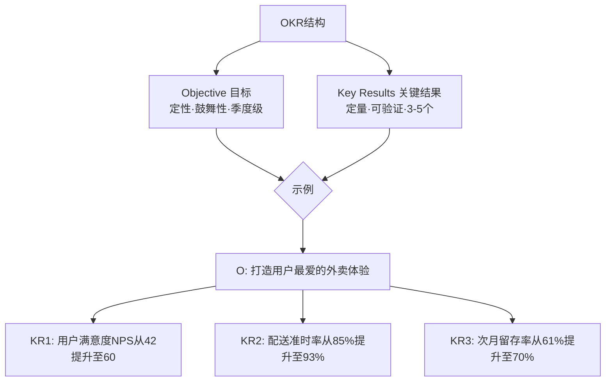
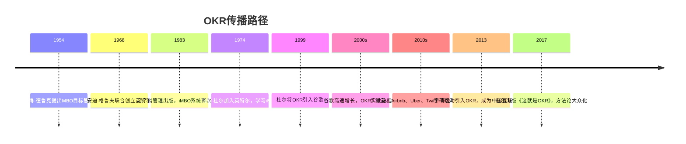
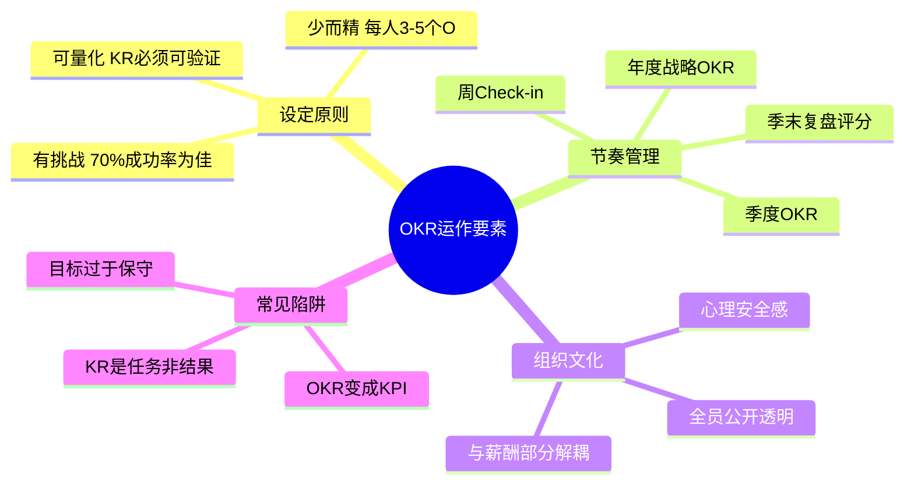

# OKR

OKR（Objectives and Key Results，目标与关键结果）是一种目标设定与追踪管理方法论，由[[安迪·格鲁夫]]在[[英特尔]]内部发明，后经约翰·杜尔（John Doerr）引入谷歌，并扩散至亚马逊、领英、Airbnb、Uber及[[字节跳动]]等全球科技公司，成为现代高成长组织最广泛采用的管理工具之一。

---

## 两个核心问题

OKR的本质可以归结为两个问题：

> **我要去哪里？** （Objective：目标）
> **我怎么知道自己正在到达那里？** （Key Results：关键结果）

**目标（Objective）**是定性的、鼓舞人心的方向性描述，回答"为什么做"与"做成什么样"；** 关键结果（Key Results）** 是可量化的里程碑，回答"如何验证目标是否达成"。两者共同构成一个完整的承诺单元。

---

## 起源：iMBO与格鲁夫的发明

OKR的前身是格鲁夫在[[高产出管理]]（High Output Management，1983年）中系统阐述的**iMBO（Intel Management by Objectives）**框架。彼时英特尔面临与日本内存厂商的激烈竞争，需要一套能让整个组织快速对齐、聚焦关键优先项的管理工具。

格鲁夫将传统MBO（Management by Objectives，德鲁克提出）的几个核心缺陷一一修正：

| 维度 | 传统MBO | 格鲁夫的iMBO / OKR |
|------|---------|-------------------|
| 设定方向 | 自上而下 | 约50%由员工自行设定 |
| 成功标准 | 100%完成 = 好 | 70%完成 = 优秀；100%说明目标定低了 |
| 透明度 | 仅上级可见 | 全员公开 |
| 周期 | 年度 | 季度滚动 |
| 薪酬绑定 | 强绑定 | 部分解耦，降低保守设目压力 |

---

## 传播：从英特尔到硅谷标配

1974年，约翰·杜尔（John Doerr）加入英特尔，师从格鲁夫，亲历iMBO的实践。1999年，杜尔作为风险投资人（KPCB合伙人）将OKR方法论带入刚成立一年的谷歌，直接向拉里·佩奇（Larry Page）和谢尔盖·布林（Sergey Brin）做了那场著名的演示。

---

## OKR的运作机制

高效的OKR体系具备以下特征：

**层级对齐**：公司级OKR → 部门级OKR → 个人OKR，每一层均可追溯至顶层战略目标，但并非机械的逐级分解，而是允许跨层对齐。

**节奏管理**：季度为基本周期，年度设定更宏观的方向性目标。每季度末进行回顾（Check-in），对关键结果评分（通常0到1.0），并反思差距原因。

**公开文化**：OKR在组织内对所有人可见，横向对齐因此成为可能——任何人都能看到其他团队的目标，主动发现协作机会或资源冲突。

---

## OKR与KPI的本质区别

OKR常被误解为"另一种KPI"，但两者有根本差异：KPI是衡量例行工作完成度的量化标准，强调稳定与可预期；OKR是驱动突破性目标的承诺工具，强调挑战与学习。在字节跳动等高速增长公司，OKR与KPI并行使用——OKR聚焦策略性优先项，KPI保障运营底线。

更多管理基础理论详见 → [[高产出管理]]；OKR在科技公司的实践案例详见 → [[字节跳动]]
