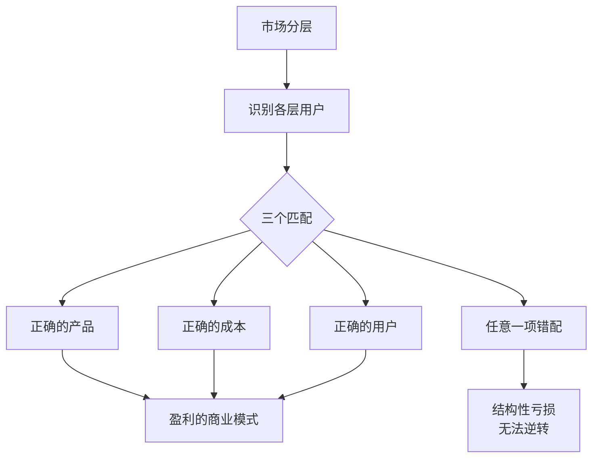
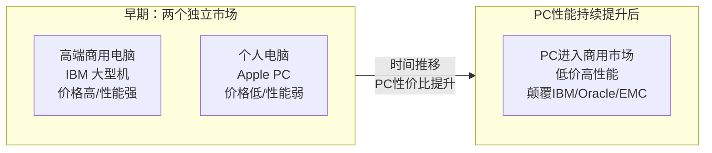
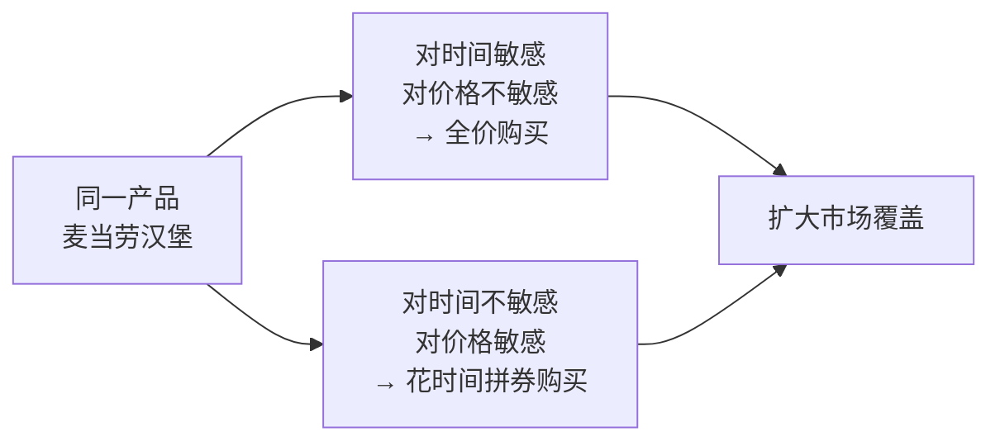
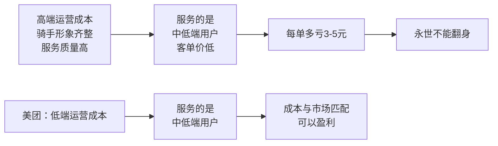
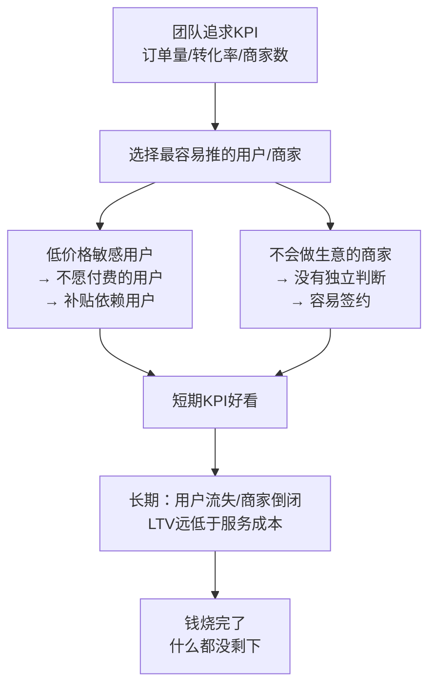

# 产品分层框架

产品分层是[[王慧文]]在美团内部产品课程中系统阐述的市场细分方法论，基于 STP+4P 理论框架延伸。核心命题是：任何市场都无法被单一产品完全覆盖，企业必须先做分层，再匹配成本与产品，否则会陷入"用错误的成本服务错误的用户"的结构性亏损。

> "分层或者分类是我们对市场一个非常重要的分法。基本上如果不做分层分类，就没有在做运营这个事。"——王慧文

---

## 核心原则



---

## 三种分层情况

### 情况一：分层产品不同

分完层之后，不同层对应完全不同的产品形态。典型代表：商用服务器 vs 个人电脑。



**最大风险：低端颠覆**。产品形态不同容易让人误以为不是同一市场，但相邻分层的产品在性价比改善后会向上渗透，颠覆高端。王慧文将此定义为[[创新者的窘境]]的核心逻辑。

阿里"去IOE"（IBM整机、Oracle数据库、EMC存储）就是这一逻辑的典型案例。当Linux服务器性价比提升后，商用软件市场被彻底重塑。

应对策略只有一个：**在颠覆发生之前，选择历史正确的一边**。一旦发生，基本无回天之力。

---

### 情况二：分层产品相同

产品本身完全相同，通过定价机制或访问门槛对用户分层。

**理发店会员卡** ：名义上用户自主选择，实则商家用折扣完成客户分层——一次性消费者付高价，频次高的用户付低价并锁定。这是一种融资工具，也是客户隔离手段。

**麦当劳优惠券** ：故意设计得很难用（剪纸/拼组合），不是产品能力不够，而是刻意隔离两类客户：



关键洞察：**优惠券是分层工具，不是促销工具**。如果优惠券做得太好用，所有人都会用，本来应该付全价的用户也享受了折扣，等于放弃了本可获得的收入。不做优惠券，则放弃了价格敏感用户的市场空间。

---

### 情况三：分层产品相似/相关

最难管理的情况：产品相关，不能完全切割，导致运营成本与目标用户极易错配。多发于提供服务的公司。

**亚马逊 Prime 困境** ：同一本书，不同用户接受 Prime / 自营 / 第三方三种不同服务，成本分别是高/中/低。理想状况是三者利润率均等，但实际中极难确保每个服务层级都服务了对应价值的用户。一旦让高价值用户用了低端服务，或让低价值用户享受了高成本服务，结构就会失衡。

---

## 反直觉案例

王慧文用一系列案例说明："优质用户"和"高价值商家"的直觉判断往往是错的。

### 宝洁洗发水的品牌形象混乱

宝洁三档洗发水的正确分层（王慧文版本）：

| 品牌 | 功能 | 定位 | 逻辑 |
|------|------|------|------|
| 海飞丝 | 去屑 | 低端 | 去屑是最基础的需求 |
| 飘柔 | 顺滑 | 中端 | 顺滑需要多洗头，高频用户 |
| 沙宣 | 塑型 | 高端 | 频繁塑型是高端需求 |

宝洁的失误：海飞丝遇到销量天花板后拼命往上走，飘柔则因打折拉低了品牌形象，导致分层混乱。品牌形象一旦下移，消费者只会认为"这个品牌就值这个价"，再也拉不回来。

**怡宝矿泉水如何建立品质感** ：瓶子厚度是唯一可感知的品质信号。在成本压力下竞争对手将瓶壁做薄，怡宝坚持瓶厚，最终在消费者心中建立了比娃哈哈更高的品质定位。品牌"范儿"丢了就再也回不去。

### 百度外卖的结构性亏损

百度外卖长期定位"品质外卖/高端外卖"。王慧文的诊断：

- 百度外卖用高端市场的**运营成本** （高密度骑手、高品质服务）
- 实际服务的是中低端市场的**用户** （北京以外客单价比美团低）
- 补贴率比美团更高，亏损率更大



> "在我们这种低毛利生意里面，把这个市场关系配置错了的后果是极其严重的，比一个功能做得好不好，根本就不是一个量级的影响。"

### 星巴克：高收入用户 ≠ 高价值用户

饿了么/百度外卖上线"免配送费"会员后，美团战投员工（高学历/高收入）大量使用，频次极高。投资人认为这是优质用户获取。恢复收费后，这批用户全部流失。

核心矛盾：**用户的收入水平、教育背景、单量，都不能说明他对配送费是否敏感**。判断一个用户是否值得用高成本服务，需要的是他的价格弹性，而非表面标签。

### 美团vs大众点评：高端商家亏钱，中端商家赚钱

两家公司合并后，王慧文团队将商家分三层，计算每个商家的实际盈亏：

| 商家层级 | 盈亏情况 | 原因 |
|---------|---------|------|
| 高端商家（星巴克、头部餐厅） | 亏损最严重 | 消费者吸引力强→商家议价强→平台让利多 |
| 中端商家 | 盈利 | 商家需要平台带客，双方有谈判空间 |
| 低端商家 | 小幅亏损 | 质量参差，运营成本高 |

大众点评高端商家占比多，听起来更"优质"；美团中端商家多，看起来更"低端"。但实际上美团赚钱，大众点评亏钱。这是整个产品分层框架最反直觉的结论。

---

## KPI陷阱：为什么团队总是做错分层



**三种极端错误** ：
1. 有钱时：所有用户一起补贴
2. 没钱时：所有用户全停补贴
3. 该补的没补，不该补的都补了

**To B业务的最重要分层** ：这个商家是否"会做生意"。不会做生意的商家：天天定制需求、很快倒闭、LTV极低、但最容易谈下来。会做生意的商家：有独立判断、谈判更难、但LTV高。

王慧文在天子星收购案例中总结：天子星的问题在于真的把头部商户当成目标市场，而竞争对手是用头部商户"讲故事"、拿了再放弃的。用真实成本做别人只是用来PR的市场，永远赚不了钱。

---

## 现金贷中的反直觉分层

银行信用卡业务：从不欠款的高信用用户是**最不赚钱** 的用户（无法收利息）。天天"拆东墙补西墙"、对利率没概念的低信用用户，反而是信用卡业务的主要利润来源。

应对策略：将永远赚不了钱的优质用户引导至另一个产品线（理财），而非强行在信用卡业务上服务他们。**分完层之后发现某类用户在这个业务里无法盈利，就该给他匹配另一个产品，而不是硬撑。**

---

## 市场体量估算陷阱

分层还影响对业务体量的判断。一个常见错误：用整个市场的体量来估算业务天花板，忽略了"真正能赚钱的市场只是其中一小段"。

高估体量的后果：投入过多资源，发现赚不到钱时已经无法收回。

---

## 核心结论

王慧文将产品分层的核心总结为：

```
用正确的成本，服务正确的用户，提供正确的产品。
```

这三个"正确"必须同时满足。任何一项错配：
- 高成本服务低价值用户 → 结构性亏损（百度外卖）
- 品牌定位混乱跨分层 → 形象无法收拾（宝洁）
- KPI驱动选择最易服务的用户 → 补贴结束后一片空白

---

## 相关条目

- [[王慧文产品课]] — 产品分层所在的完整课程体系
- [[王慧文]] — 讲者简介
- [[供需关系与产品设计]] — 分层的前置理论框架（STP+4P）
- [[用户价值模型]] — 用户价值的衡量框架
