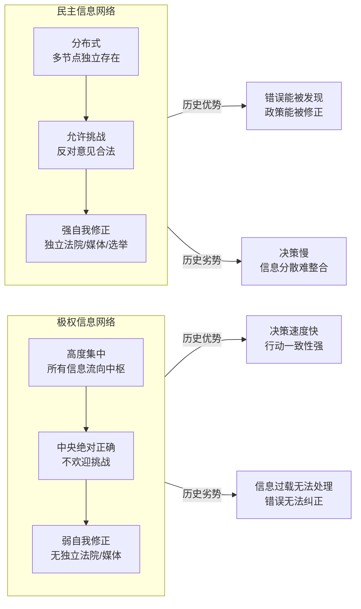
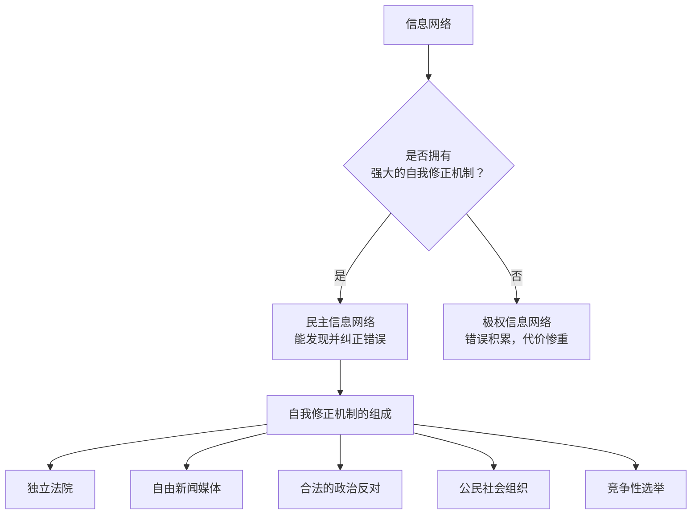

# 信息网络政治学

由尤瓦尔·赫拉利在《[[智人之上]]》中发展的分析框架：**将民主与极权理解为两种不同架构的信息网络**，而非仅仅是道德或意识形态的对立。这一框架提供了一种分析AI时代政治变局的结构性工具。

---

## 核心框架

### 两种信息网络架构

---

## 四个维度的对比

### 1. 信息流向

**极权**：信息从地方流向中央。罗马的条条大路通罗马；纳粹德国的一切信息流向柏林；苏联的所有信息汇聚到莫斯科。中央掌握最终决策权。

**民主**：信息在多个独立节点之间流动。立法机构、法院、媒体、企业、公民个人可以直接相互沟通，大量重要决策在政府之外做出。

### 2. 对错误的态度

**极权**：认定中央绝对正确，不欢迎任何挑战。历史上独裁者将独立法院和自由媒体视为威胁，持续削弱之（罗马元老院、苏联司法）。

**民主**：制度性地承认决策者会犯错。选举、司法审查、新闻自由都是发现并纠正错误的机制。美国宪法在文本中明确提供了修正自身的程序（第五条）。

### 3. 技术与制度的共生关系

不同时代的信息技术，对两种网络的强化效果不同：

| 技术 | 有利于极权的原因 | 有利于民主的原因 |
|------|---------------|---------------|
| 印刷机 | 可集中印制宣传 | 也可印制反对声音，无法完全垄断 |
| 电报/无线电 | 有利于中央统一发布指令 | 同上，但扩散更难控制 |
| 电视 | 利于大众宣传 | 同上 |
| 互联网/社交媒体 | 算法可制造信息茧房 | 也可支持去中心化沟通 |
| **机器学习/AI** | **翻转历史劣势**（见下） | 信息茧房威胁公共对话 |

### 4. AI对两种网络的不对称冲击

这是赫拉利分析最有原创性的部分：

**极权的历史劣势被AI翻转**：
- 极权想把所有信息集中处理，但人类官僚无法处理大量数据，常常犯错
- AI擅长处理海量数据，而且数据越多效率越高
- 因此，极权体制的信息集中不再是劣势，而可能成为决定性优势

**案例**：遗传算法——拥有14亿人口且隐私法规宽松的国家，能比拥有500万人口且隐私法规严格的国家训练出准确得多的医学算法；其他国家将有强烈动机购买前者的算法，进而导致更多数据向前者集中，形成正反馈循环。

**民主的历史优势受到威胁**：
- 民主的优势在于开放的公共对话，能够聚合分散的信息、发现政策错误
- 推荐算法制造信息茧房，破坏不同观点之间的对话基础
- AI生成的大量内容可能让公民再也无法区分真人、真事件和AI合成

---

## 自我修正机制是关键区分

赫拉利特别强调：**自我修正机制的有无**，而非"是否有选举"，才是区分民主与极权信息网络的核心。

**科学的类比**：科学之所以进步，不是因为科学家都是诚实的天才，而是因为科学共同体有系统性的**错误纠正机制**——同行评审、可复现要求、公开发表。民主与科学共享同一种元层面的设计哲学。

---

## 历史案例

### 苏联：极权信息失败的教科书

索尔仁尼琴的《古拉格群岛》记录了苏联信息网络的系统性失效：

- 党代会上没有人敢第一个停止鼓掌（掌声持续11分钟），因为内务人民委员部在监视谁先停下
- 这种全面的恐惧导致领导层只能接收到经过过滤的"好消息"，无法获得真实信息
- 李森科事件：苏联支持伪科学农业理论，批判孟德尔遗传学，导致农业长期落后

这些都是缺乏自我修正机制的系统性后果。

### 美国宪法：诚实的虚构

与宣称"神圣起源"的宗教法典不同，美国宪法开头明确说："我们美利坚合众国的人民……制定和确立这一部宪法。"

这种"诚实的虚构"——承认宪法是人类创造的惯例——为修正自身提供了合法性。不到一个世纪后，第十三修正案废除奴隶制。相比之下，声称来自神圣权威的秩序，很难通过自身机制加以纠正。

---

## 对AI时代的政策含义

1. **民主国家的优先任务**：保护自我修正机制不受算法侵蚀（防止推荐系统破坏公共对话空间）
2. **不能单靠"市场竞争"**：信息市场有强烈的赢家通吃倾向（谷歌占全球搜索91.5%），不同于传统商品市场
3. **AI监管是制度性问题，不只是技术问题**：谁能修正AI的错误？谁有权决定AI的目标？这些都是信息网络架构问题
4. **全球层面**：硅幕风险意味着任何单一国家的"负责任AI"都不足以保护自己——需要国际机制

---

## 批判性视角

**反驳**：民主国家也有大量虚假信息和信息操控（选举干预、媒体偏见）。赫拉利的"民主=自我修正"是否过于理想化？

**赫拉利的回应**：民主不是完美的，而是比极权"更能发现和修正自身错误"——这是相对优势，不是绝对理想。美国宪法允许被修正，这就比"十诫"无法修正这一特点更优越。

---

## 相关文章

- [[智人之上]] — 原著书评
- [[信息联结论]] — 本框架的哲学基础
- [[系统思考]] — 第五项修炼中的系统反馈与本框架的共鸣
- [[战略思维]] — 信息优势在战略竞争中的作用
