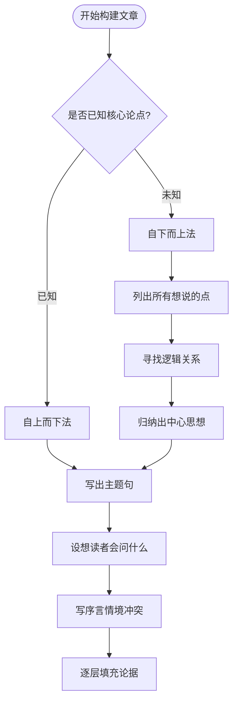

# 写作结构技术

写作结构技术是指在书面表达中，通过明确的逻辑骨架组织思想的一套操作性方法。基于金字塔原理，这些技术将抽象的思维规律转化为可执行的写作步骤，适用于商业报告、分析备忘录、咨询提案等各类专业文体。

## 序言的四种结构模式

序言（前言、引言）的核心功能是将读者的已知信息与文章将要回答的疑问连接起来。好的序言采用讲故事的形式，遵循**情境（S）—冲突（C）—疑问（Q）—回答（A）** 四要素，通称 SCQA 模式。

**情境（Situation）** 是读者熟悉且认可的客观背景。选择情境的标准是：读者读到此处会点头认同，不产生任何争议。情境的作用不在于提供新信息，而在于把读者引入讨论的语境。

**冲突（Complication）** 是破坏情境稳定性的变化或问题。冲突是序言的转折点，它将"已知"与"待解"之间的张力呈现出来。读者在认可情境之后，面对冲突时会自然产生"那又怎样？"或"那我们应该怎么办？"的疑问反应。

**疑问（Question）** 是由情境与冲突共同引发的核心问题。一篇文章通常只需回答一个核心疑问，常见类型有四种：*我们应该做什么？我们应该如何做？我们是否应该这样做？为什么会发生这种情况？*

**回答（Answer）** 即文章的中心论点，是对核心疑问的直接回答，同时也是金字塔结构顶端的思想。

根据情境与冲突出现的顺序和侧重，序言有多种变体模式：

| 模式 | 特点 | 典型场景 |
|------|------|----------|
| 标准型（S→C→Q→A） | 情境充分，冲突明确 | 分析报告、建议书 |
| 倒叙型（A→S→C→Q） | 先给结论，再解释背景 | 高管摘要、执行简报 |
| 追问型（S→C→Q，A在后文展开） | 序言只引出疑问，正文逐步回答 | 长篇研究报告 |
| 冲突前置型（C→S→Q→A） | 先陈述冲突，再交代背景 | 危机沟通、紧急建议 |

实际写作中，序言应当**只告诉读者他已经知道的信息** ，绝不在序言中引入读者尚未了解的新论据。论据的展开属于正文的任务。

## 演绎推理的三段论结构

演绎推理是从已知的普遍规律推导特殊结论的逻辑形式，其标准结构为：

1. **大前提** ：陈述某个普遍成立的规律或事实（例：所有管理失败的产品概念并非概念本身有误）；
2. **小前提** ：对大前提中的主语或谓语作出特殊陈述，与大前提形成评注关系（例：产品管理失败的案例几乎都源于管理层的误用）；
3. **结论** ：由大前提与小前提共同推导（例：因此产品管理本身是有效的概念）。

识别演绎推理的操作性检验：**查看第二个观点是否对第一个观点的主语或谓语进行了评注**。若是，则两者之间具有演绎关系，必然能推出"因此"引导的结论。

演绎推理也可以扩展为**连环式演绎推理** ，即结论A成为下一轮推理的大前提，继续推出结论B。但实践中不建议超过四个推理步骤或两层"因此"的嵌套，否则读者的理解负担将急剧增加。

**总结演绎推理的方法** ：
- 将最终推导的结论置于金字塔结构的顶端；
- 在摘要中，以"因此"连接前提群与最终结论；
- 改写措辞，使陈述流畅自然，消除逻辑套话的痕迹。

## 归纳推理：寻找思想的共性

归纳推理将一组独立但具有共性的观点并列，并从中归纳出覆盖所有观点的总体结论。归纳的本质操作是**在句子的主语、谓语或隐含意义中寻找相似点**。

**主语相似** ：若一组句子的主语性质不同，则在谓语（即各主语所做的事）中寻找共同点，并将谓语所指向的对象类型作为归纳结论的基础。

**谓语相似** ：若一组句子的谓语本质相同，则在主语（即执行行动的对象）中寻找共同点，从中归纳出一个能涵盖所有主语的上位类别。

**隐含意义相似** ：若主语与谓语均无直接共性，则需追问每个陈述背后隐含的判断或结论，在这些隐含结论之间寻找属于同一范畴的相似性。

> "做归纳推理摘要，难度要高于演绎推理，因为做摘要的过程就是完成推论的过程。"
> —— 芭芭拉·明托，《金字塔原理2》

找到共性之后，需为该组思想确定一个**单一名词** （即能概括该组所有思想的类型词），通常属于以下三类：
- **理由** ：回答"为什么"；
- **步骤** ：回答"如何做"；
- **证明** ：回答"你如何知道"。

归纳总结不是重复其中某一个论点，而是从所有论点共同指向的结果或模式中提炼出新的、更高层级的判断。

## 行动性思想的因果结构

在总结行动类内容（建议、步骤、目标、改革措施）时，一个常见错误是以**类别标题代替因果结论** ——例如将三条行动建议的上层总结写成"我们将采取以下三项措施"，而非说明这三项措施执行后将带来什么具体结果。

正确的做法是：**上层论点应陈述执行下层行动后可以取得的直接结果**。例如，三条提高股票销售的步骤，其上层论点应是"积极掌握伦敦股票市场的可能商机"，而非"提高股票销售的三个步骤"。

区分这两种写法的实践检验：读完上层论点后，如果读者产生"那又怎样？"的疑问，说明上层论点是空洞主张；如果读者产生"如何做到？"的疑问，说明上层论点已经携带了实质性结论，结构正确。

## 论点标签的使用

论点标签是一种将每个论点压缩为简洁短语的辅助工具，用于在金字塔结构图中快速标注和比较各节点的内容。标签的功能不在于传达完整论点，而在于帮助作者直观地检验结构完整性。

使用论点标签时，可以进行以下三项快速检验：
1. 同一层级的各标签，是否可以用同一个单一名词（理由、步骤、证明）加以描述？如不能，说明该层级存在分类混乱；
2. 各标签之间是否存在逻辑重叠或明显遗漏？
3. 上层标签是否真正是下层所有标签共同指向的归纳结论，而非仅仅是其中某一个的变体？

## 常见结构错误

**目录式写作** ：序言只列出将要讨论的主题清单，而不构建情境—冲突—疑问的完整故事，导致读者无法预知文章要回答的核心问题。

**垂直思维陷阱** ：在尚未确定横向逻辑关系（演绎或归纳）的情况下，急于向下展开论据，导致各层级之间的逻辑跳跃难以被发现。

**缺乏核心思想** ：正文中罗列大量信息和论据，但顶端始终没有一个能够将全部内容统摄起来的中心论点，读者无法形成对文章的整体判断。

**上层总结重复下层** ：归纳一组行动性论点时，仅将其中某一个论点复述为上层总结，而非从整体因果关系中提炼新的结论。

> "如果陈述论点时简洁一些，读者和作者都更易于把握文章的金字塔结构。"
> —— 芭芭拉·明托，《金字塔原理2》
