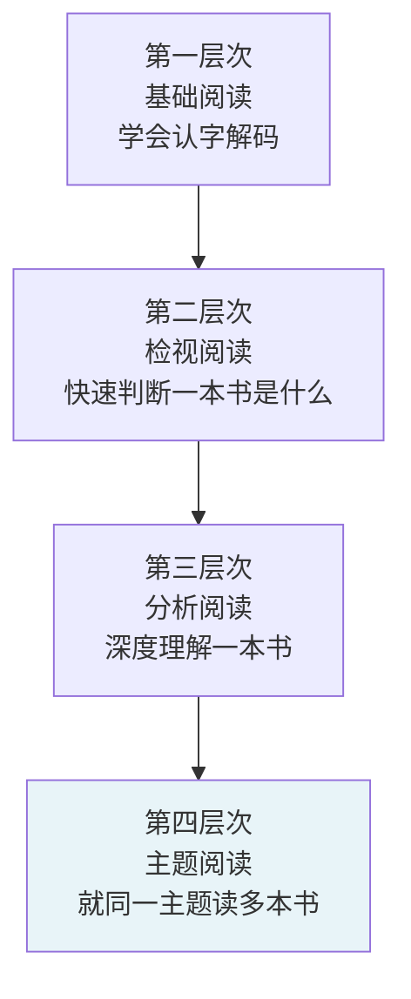
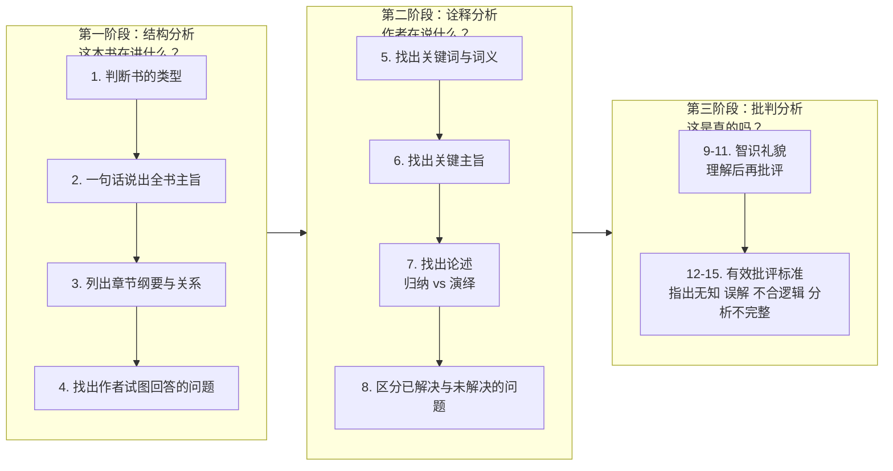
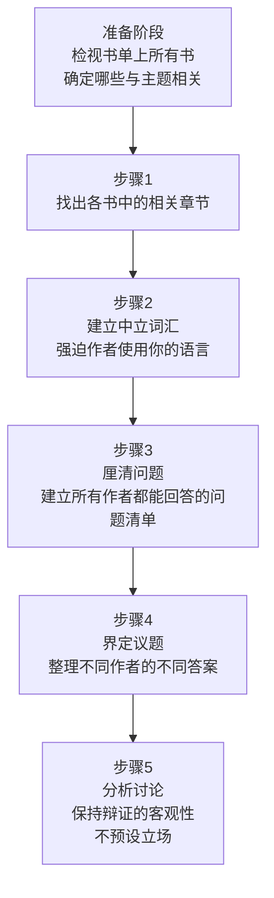
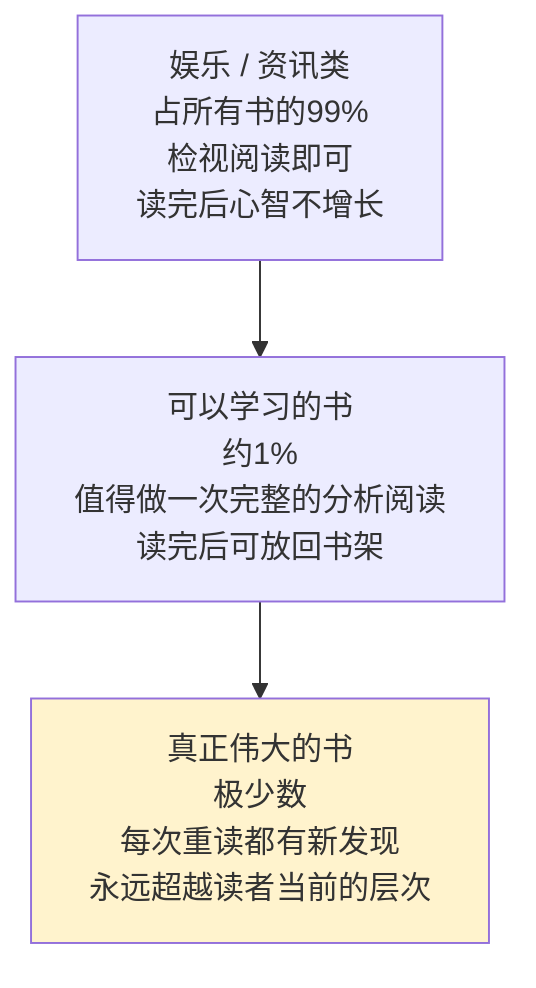

# 分析阅读方法

《如何阅读一本书》由莫提默·J·艾德勒与查尔斯·范多伦合著，1940年首版，1972年修订。全书的核心主张是：阅读分为四个层次，绝大多数人止步于初级层次，而更深的层次需要系统性的主动技巧。

## 核心区分：为娱乐 vs 为理解

书的起点是一个区分：

- **为娱乐或获取资讯的阅读**：作者已与读者在同一水平。读完后你知道更多，但理解力没有增长。
- **为理解而阅读**：作者站在读者水平之上。读完后你的思考能力提升了。

只有第二种阅读才能让心智成长。"心智就跟肌肉一样，如果不常运用就会萎缩。"

## 四个阅读层次

层次是累积渐进的，高层次包含所有低层次。

**第一层次：基础阅读**
学会阅读本身，理解文字字面含义。大多数成年人已具备。

**第二层次：检视阅读**
目标：快速回答"这是什么样的书？""大概在讲什么？"两个阶段：
1. 系统性略读：标题 → 目录 → 索引 → 出版资讯 → 阅读几个核心章节
2. 粗浅阅读：不停顿从头读到尾，遇到不懂的地方继续往下，先建立整体感再填补细节

**第三层次：分析阅读**
对一本书进行深度、彻底的阅读。共15条规则，分三个阶段。

**第四层次：主题阅读**
就同一个问题阅读多本书，构建自己的议题框架，而非追随任何单一作者。

---

## 分析阅读的三阶段15规则

### 第一阶段：结构分析

**规则1：判断书的类型与主题**
区分论说性作品（实用 vs 理论）与想象文学。理论类再分：历史、科学、哲学。

**规则2：用一句话说出整本书在讲什么**
不是总结章节，而是抓住全书的统一主题。

**规则3：列出主要部分的纲要**
找出书的"骨架"，理解各部分如何服务于整体。

**规则4：找出作者试图回答的问题**
作者面对什么问题？提出的解决方案是什么？

### 第二阶段：诠释分析

**规则5：找出关键词，与作者达成共识**
区分词（word）与词义（term）。同一个词在不同语境可有不同词义；找到关键词，锁定作者赋予它的特定含义。

**规则6：从关键句子中找出关键主旨**
测试理解的标准：能否用自己的话重述？能否举例说明？仅能背诵是"言辞主义"（verbalism），而非理解。

**规则7：找出论述**
归纳论述：从具体事实推出结论。演绎论述：从原则推出结论。区分哪些是假设、哪些是已证明、哪些是自明的道理。

**规则8：区分已解决与未解决的问题**
好作者会承认问题未完全解决。读者要分清哪些在书中已有答案，哪些仍悬而未决。

### 第三阶段：批判分析（智识礼貌）

**规则9-11：先理解，再批评**
没有完全理解之前不得批评。情绪上的反对不等于知识上的不同意。

**规则12-15：有效批评的四种标准**
- 指出作者资讯不足（uninformed）
- 指出作者资讯有误（misinformed）
- 指出作者论述不合逻辑（illogical）
- 指出作者分析不完整（incomplete）

前三条是否定性批评；第四条是"书未能完成任务"，比前三条弱。

---

## 主题阅读的五个步骤

当一个问题需要读多本书时，进入第四层次：

主题阅读最困难的地方是步骤2：**你要建立自己的词汇框架，而不是追随任何一位作者的词汇框架**。每接受某位作者的一套词义，就等于把自己锁在他的世界里，无法真正理解其他作者。

"辩证的客观"是理想目标：面面俱到呈现各种立场，自己不预设立场。

---

## 阅读不同类型书籍的方法

### 论说性作品

| 类型 | 读法要点 |
|------|----------|
| 历史 | 读同一事件的多位历史学家；区分事实陈述与诠释；问三个问题：发生了什么、为何发生、有何启示 |
| 科学与数学 | 经典科学著作是为普通读者写的，可以读；数学是一种语言，把符号当外语学；首次阅读可跳过详细证明 |
| 哲学 | 识别哲学家的核心问题（自由、正义、知识等）；不必接受前提再评判；哲学家会问"有没有上帝"而非"假设有上帝" |
| 社会科学 | 混杂科学、哲学、历史，需先判断当前所读段落属于哪种；高度依赖主题阅读 |
| 圣典/经书 | 读者在心理上无法质疑权威，这是阅读自由的丧失 |

### 想象文学

- **不要试图从小说中寻找论点**：找作者要你感受什么，而非主张什么
- 快速读完整本，不要停下来查字典
- 悬置判断：住在小说世界里，感受其中的生活，再评判
- 戏剧要在心中搭起舞台；诗要大声朗读

---

## 主动阅读：四个核心问题

读任何一本书，都要保持追问：

1. **这本书整体在讲什么？**（结构）
2. **作者在细节上说了什么，是如何说的？**（诠释）
3. **这本书说得对吗？全部还是部分？**（批判）
4. **这本书与我何干？**（应用）

前两个问题是理解，后两个是评价与应用。大多数读者只做前两步，忽略了后两步。

---

## 书的金字塔

艾德勒将书分为三层：

"一本好书能在你每次重读时都给你新的启发——每次都仿佛是一本新书。"真正伟大的书，永远跑在读者前面。

---

## 滑雪类比与学习困境

艾德勒把学习分析阅读规则比作学滑雪：

初学者必须把每个动作分开练习（重心转移、手杖动作、弯膝），这反而让整体动作变得更笨拙。只有经过刻意练习，各规则内化之后，才能同时运用所有技巧，流畅地"读"。

在规则还没有内化前，就放弃"太机械"——是大多数读者学不会分析阅读的根本原因。

---

## 言辞主义陷阱

"言辞主义"（verbalism）：能背诵，但无法理解。

测试是否真正理解一个主旨：
1. 能否用**自己的话**重新表述？（不能只换几个近义词）
2. 能否给出一个**具体例子**？
3. 如果是实用性建议，能否说出在什么条件下**适用**或**不适用**？

三条都能做到，才算理解。否则只是记住了词句。

---

## 参考资料

- 《如何阅读一本书》莫提默·J·艾德勒、查尔斯·范多伦，1972年修订版
