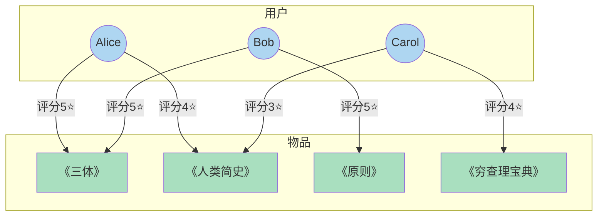
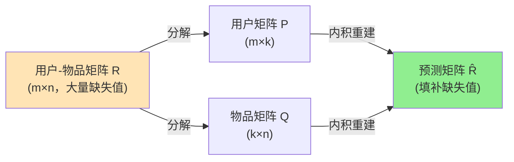

# 协同过滤算法

协同过滤（Collaborative Filtering）是基于用户行为数据的推荐算法总称，其核心思想是"用户可以齐心协力，通过和网站不断互动使推荐列表能过滤掉自己不感兴趣的物品"。学术界将仅基于用户行为数据设计的推荐算法统称为协同过滤算法，主要包括基于邻域的方法、隐语义模型和基于图的随机游走算法。


*图：用户-物品评分矩阵，空白处即为推荐系统需要预测填充的位置*

## 主要算法横向对比

| 算法 | 核心思想 | 时间复杂度 | 可解释性 | 冷启动 | 最适场景 |
|------|---------|-----------|---------|-------|---------|
| UserCF | 找相似用户的喜好 | O(M²N) | ⭐⭐⭐ "与你口味相近的人喜欢…" | 差 | 新闻、社交 |
| ItemCF | 找相似物品 | O(MN²) | ⭐⭐⭐ "因为你喜欢X，推荐Y" | 中 | 电商、视频 |
| LFM/SVD | 隐语义空间分解 | O(iter·M·N·K) | ⭐ 黑盒 | 差 | 评分预测 |
| PersonalRank | 图随机游走 | O(edges·iter) | ⭐⭐ | 中 | 社交推荐 |

## 用户—物品二分图示意



## UserCF：基于用户的协同过滤

### 原理

UserCF 是推荐系统领域最古老的算法，1992 年诞生，最初应用于电子邮件过滤系统 Tapestry，1994 年被 GroupLens 用于新闻过滤，后被新闻分享网站 Digg 采用。

算法主要分两步：
1. 找到与目标用户兴趣相似的用户集合
2. 找到该集合中用户喜欢的、目标用户没有接触过的物品推荐给目标用户

### 相似度计算

**余弦相似度** （最常用）：

```
w(u,v) = |N(u) ∩ N(v)| / sqrt(|N(u)| * |N(v)|)
```

其中 N(u) 是用户 u 产生过正反馈的物品集合。

**高效实现** ：先建立物品→用户的倒排表，避免对所有用户两两计算：

```python
def UserSimilarity(train):
    item_users = dict()
    for u, items in train.items():
        for i in items.keys():
            item_users.setdefault(i, set()).add(u)
    C = dict()  # 共现矩阵
    N = dict()  # 每个用户的行为数
    for i, users in item_users.items():
        for u in users:
            N[u] = N.get(u, 0) + 1
            for v in users:
                if u == v:
                    continue
                C.setdefault(u, {})
                C[u][v] = C[u].get(v, 0) + 1
    W = dict()
    for u, related_users in C.items():
        for v, cuv in related_users.items():
            W.setdefault(u, {})
            W[u][v] = cuv / math.sqrt(N[u] * N[v])
    return W
```

时间复杂度：O(N*(K/N)^2)，其中 N 为用户数，K 为总行为记录数。

### 改进：User-IIF（惩罚热门物品）

热门物品上的共同行为对用户相似度的贡献应该小于冷门物品——"两个用户都买过《新华字典》"不如"两个用户都买过《数据挖掘导论》"能说明兴趣相似：

```python
# 关键修改：对热门物品降低权重
C[u][v] += 1 / math.log(1 + len(users))  # 替代原来的 += 1
```

MovieLens 实验表明 User-IIF 在准确率、召回率、覆盖率和新颖度上均略优于基础 UserCF。

### 推荐公式

```
p(u,i) = Σ_{v∈S(u,K)∩N(i)} w(u,v) * r(v,i)
```

其中 S(u,K) 是与用户 u 兴趣最相近的 K 个用户，N(i) 是对物品 i 有过行为的用户集合，r(v,i)=1（隐反馈数据）。

### 适用场景

- 时效性较强的内容（新闻、文章），物品更新速度快于用户增加速度
- 用户个性化兴趣不太明显、更强调热点和时效性的领域
- 用户数量远小于物品数量的场合

## ItemCF：基于物品的协同过滤

### 原理

ItemCF 由亚马逊提出（2003），目前是业界应用最广泛的算法。Netflix、Hulu、YouTube 的推荐算法均以 ItemCF 为基础。

算法核心：给用户推荐和他之前喜欢的物品相似的物品。物品 A 和物品 B 相似，是因为喜欢 A 的用户大都也喜欢 B——**相似度来自用户行为，而非物品内容** 。

主要分两步：
1. 计算物品之间的相似度
2. 根据物品相似度和用户历史行为生成推荐列表

### 物品相似度计算

```
w(i,j) = |N(i) ∩ N(j)| / sqrt(|N(i)| * |N(j)|)
```

分母中对 j 的热门度进行了惩罚，避免任何物品都与热门物品高度相似（哈利波特问题）。

```python
def ItemSimilarity(train):
    C = dict()
    N = dict()
    for u, items in train.items():
        for i in items:
            N[i] = N.get(i, 0) + 1
            for j in items:
                if i == j:
                    continue
                C.setdefault(i, {})
                C[i][j] = C[i].get(j, 0) + 1
    W = dict()
    for i, related_items in C.items():
        for j, cij in related_items.items():
            W.setdefault(i, {})
            W[i][j] = cij / math.sqrt(N[i] * N[j])
    return W
```

### 推荐公式

```
p(u,j) = Σ_{i∈N(u)∩S(j,K)} w(j,i) * r(u,i)
```

其中 N(u) 是用户 u 喜欢的物品集合，S(j,K) 是与物品 j 最相似的 K 个物品。

**带推荐解释的实现** （ItemCF 的独特优势）：

```python
def Recommendation(train, user_id, W, K):
    rank = dict()
    ru = train[user_id]
    for i, pi in ru.items():
        for j, wj in sorted(W[i].items(),
                            key=itemgetter(1), reverse=True)[0:K]:
            if j in ru:
                continue
            rank.setdefault(j, {'weight': 0, 'reason': {}})
            rank[j]['weight'] += pi * wj
            rank[j]['reason'][i] = pi * wj  # 记录推荐理由
    return rank
```

### 改进：ItemCF-IUF（惩罚活跃用户）

活跃用户（如开书店者购买了大量书籍）对物品相似度的贡献应小于普通用户：

```python
C[i][j] += 1 / math.log(1 + len(items) * 1.0)  # IUF 惩罚活跃用户
```

### 改进：相似度矩阵归一化

按列最大值归一化可以消除不同类别物品之间相似度尺度不一致的问题，从而提高推荐的多样性和覆盖率：

```
w'(i,j) = w(i,j) / max_k w(i,k)
```

MovieLens 实验：ItemCF-Norm 在准确率、召回率、覆盖率和新颖度上均优于基础 ItemCF。

## UserCF 与 ItemCF 的横向对比

| 维度 | UserCF | ItemCF |
|------|--------|--------|
| 推荐原理 | 推荐相似用户喜欢的物品，偏向群体热点 | 推荐与历史喜好相似的物品，维系个人兴趣 |
| 性能 | 用户多时相似度矩阵空间 O(M²) | 物品多时相似度矩阵空间 O(N²) |
| 领域 | 时效性强、个性化需求不明显（新闻） | 长尾丰富、个性化需求强烈（电商、电影） |
| 实时性 | 新行为不一定立即改变推荐结果 | 新行为立即导致推荐结果变化 |
| 冷启动 | 新用户需等待相似度表更新 | 新用户只要有一个行为即可推荐 |
| 推荐解释 | 很难提供令用户信服的解释 | 可用历史行为解释，用户信服度高 |
| 代表应用 | Digg（新闻推荐） | 亚马逊、Netflix、Hulu |

**选择依据** ：
- 物品更新频率快（新闻）→ UserCF（物品相似度表难以频繁更新）
- 物品相对稳定且用户个性化需求强（图书、电影）→ ItemCF
- 用户数远大于物品数 → ItemCF（避免超大用户相似度矩阵）
- Netflix Prize（40 万用户）：UserCF 需约 30 GB 内存，ItemCF 更可行

## 隐语义模型（LFM / 矩阵分解）

### 矩阵分解示意



### 原理

隐语义模型（Latent Factor Model，LFM）通过**隐含特征** 联系用户兴趣和物品。其核心思想是：先对物品和用户进行自动聚类，再基于聚类结果推荐。

LFM 预测公式：

```
Preference(u, i) = p_u · q_i = Σ_k p_{uk} * q_{ik}
```

其中 p_{uk} 度量用户 u 与第 k 个隐类的关系，q_{ik} 度量物品 i 与第 k 个隐类的关系。

### 负样本采样

隐性反馈数据只有正样本（用户喜欢的物品），需要人工构造负样本：
- 保证正负样本数量平衡
- 倾向于采样热门但用户没有行为的物品（更能代表用户不感兴趣）

```python
def RandomSelectNegativeSample(self, items):
    ret = {i: 1 for i in items.keys()}
    n = 0
    for _ in range(len(items) * 3):
        item = items_pool[random.randint(0, len(items_pool) - 1)]
        if item in ret:
            continue
        ret[item] = 0
        n += 1
        if n > len(items):
            break
    return ret
```

### 随机梯度下降优化

损失函数（加正则化防止过拟合）：

```
L = Σ_{(u,i)∈K} (r_{ui} - p_u·q_i)² + λ(‖p_u‖² + ‖q_i‖²)
```

迭代更新：

```
p_{uk} += α * (e_{ui} * q_{ik} - λ * p_{uk})
q_{ik} += α * (e_{ui} * p_{uk} - λ * q_{ik})
# 每次迭代衰减学习率：α *= 0.9
```

重要参数：隐特征数 F、学习率 α、正则化参数 λ、负样本/正样本比例 ratio。

### 优势与局限

**优势（对比邻域方法）** ：
- 理论基础更好，是有监督学习方法
- 空间复杂度 O(F*(M+N))，大幅优于 O(M²) 或 O(N²)
- 在数据稠密时离线性能通常优于 UserCF/ItemCF

**局限** ：
- 训练耗时，无法实时推荐（每次需扫描全部行为数据，离线计算）
- 在线推荐时间复杂度 O(M*N*F)，物品数量大时不适合实时计算
- 无法提供推荐解释（隐类语义难以用自然语言描述）
- 数据极度稀疏时效果下降明显

### LFM vs 邻域方法复杂度对比

| 方法 | 空间复杂度 | 训练时间复杂度 | 在线实时性 |
|------|-----------|----------------|-----------|
| UserCF | O(M²) | O(N*(K/N)²) | 支持 |
| ItemCF | O(N²) | O(M*(K/M)²) | 支持 |
| LFM | O(F*(M+N)) | O(K*F*S) | 不支持（离线预计算） |

（M=用户数，N=物品数，K=行为记录数，F=隐类数，S=迭代次数）

## 基于图的推荐（PersonalRank）

### 二分图表示

用户行为数据可以表示为用户—物品二分图 G(V,E)，其中圆形节点代表用户，方形节点代表物品，边代表用户对物品的行为。

### PersonalRank 算法

基于随机游走在二分图上度量用户与物品节点的相关性：

从用户节点 v_u 出发随机游走：
- 以概率 α 继续游走到相邻节点（均匀分布）
- 以概率 1-α 重新从 v_u 出发

迭代公式：

```
PR(v) = (1-α) * [v==v_u] + α * Σ_{v'∈in(v)} PR(v') / |out(v')|
```

```python
def PersonalRank(G, alpha, root):
    rank = {x: 0 for x in G.keys()}
    rank[root] = 1
    for k in range(20):  # 迭代约 9 次即收敛
        tmp = {x: 0 for x in G.keys()}
        for i, ri in G.items():
            for j, wij in ri.items():
                tmp[j] = tmp.get(j, 0) + alpha * rank[i] / len(ri)
                if j == root:
                    tmp[j] += 1 - alpha
        rank = tmp
    return rank
```

### 矩阵形式（加速计算）

PersonalRank 可转化为矩阵方程，避免迭代：

```
rank = (1-α) * (I - α*M)^{-1} * r₀
```

其中 M 是转移概率矩阵。利用稀疏矩阵快速求逆算法可大幅降低计算代价。

### 局限性

PersonalRank 的主要缺点是时间复杂度高：每次为用户推荐都需要在整个二分图上迭代直至收敛，既无法在线实时推荐，离线计算也较耗时。

详细工程实现与系统架构见 [[推荐系统工程实践]]，评分预测场景下的矩阵分解见 [[评分预测与模型融合]]。
