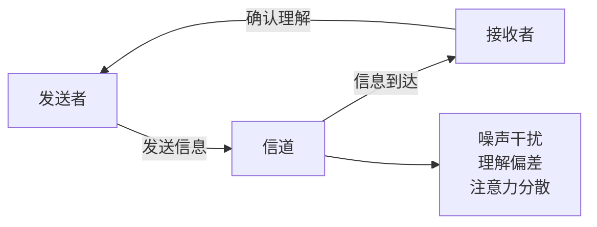
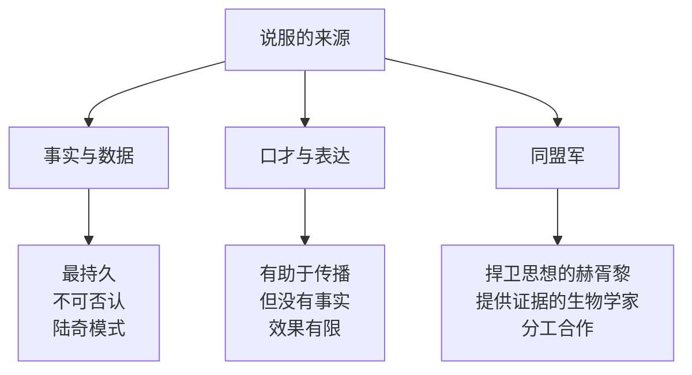

# 吴军沟通方法论

[[见识]]第十一章系统总结了吴军在谷歌和硅谷多年实践中观察到的沟通规律。核心论点是：**沟通的标准是达到目的，而非展示努力**。

吴军用"牧师和司机的笑话"来说明这一点：一位牧师死后到了天堂，但彼得告诉他，他只能进地狱；而司机却被直接送进天堂。牧师不解，彼得解释说：你传道时大家都睡着了；司机开车时大家都在祈祷。**效果比苦劳更重要，没有效果，苦劳也不算。**

## 讲话的三大常见毛病

很多人沟通无效，原因可以归结为三类：

**缺乏针对性**：对什么人说什么话，是沟通的基本前提。把给专家听的内容讲给外行，或把给外行准备的材料用在专业场合，都是无效的。

**内容太多塞不进**：人的注意力和记忆容量有限。一次沟通能传递的有效信息，通常不超过三个关键点。把十件事塞进一次汇报，对方能记住的往往是零。

**哗众取宠**：用夸张的表达、炫技的数据或耸人的标题吸引注意，但没有实质内容支撑。听众事后会觉得"什么都没说"，反而损害信任。

## 通信协议原则

吴军将沟通比作通信协议（communication protocol）：**信息发送 ≠ 信息接收**。

有效沟通需要"确认机制"：发送方需要主动确认对方是否理解了自己的意思，而不是默认"我说了就等于对方听懂了"。这是高盛等机构要求所有重要指令书面确认的底层逻辑。

## 赵小兰讲理的四个特点

吴军以美国前劳工部长赵小兰为例，总结了在政治场合有效讲理的四个特点：

1. **观点鲜明**：立场清晰，不模糊，不走钢丝。听众知道她在说什么、反对什么。
2. **以子之矛陷子之盾**：用对方自己的逻辑或数据反驳对方，对方无从辩驳。这比提出新论据更有力。
3. **语气平和**：不激动，不攻击，不情绪化。情绪激动的人会让听众把注意力放在情绪上，而不是观点上。
4. **理直气壮**：事实站得住，就要讲得有力度，不要因为"怕冒犯"而把话说软。

## 靠什么说服人：事实 > 口才

吴军用日心说的历史说明说服力的来源：

**布鲁诺** 相信日心说，四处演讲宣传，言辞激烈，最终被烧死，学说并未因他而传播。

**伽利略** 用望远镜观测，积累天文数据，让教会无法否认观测事实，才推动了日心说的接受。

结论是：**说服力来自事实，不来自口才**。口才只能让人"暂时相信"，事实才能让人"无法反驳"。

**陆奇说服杨致远的案例**：陆奇在加入雅虎担任技术副总裁前，事先模拟了所有杨致远可能提出的问题，为每个问题准备了数据支撑的答案。杨致远提出的每个疑问，陆奇都能当场用数字回应。这不是"口才好"，而是准备充分。

**赫胥黎模式**：达尔文提出进化论后，自己并不擅长公开辩论，于是赫胥黎成为他的"斗犬"，在公开场合捍卫进化论；而与此同时，有一批生物学家在持续积累实证数据，两类同盟军各司其职，最终让进化论被科学界接受。这说明**一个重要观点的传播，需要两类人**：捍卫思想的人，和提供证据的人。

## 如何做好演讲

吴军以一次风险投资路演为例，给出了高效演讲的结构模型：

**案例**：某基金在年会上用 10 分钟、5 张 PPT 向 LP（有限合伙人）介绍自己。5 张 PPT 的内容分别是：

1. **我们是谁**：团队背景和核心能力（30 秒建立信任）
2. **我们提供什么**：基金投资范围、规模、条款
3. **我们的投资哲学**：判断好项目的标准（差异化）
4. **我们对项目的看法**：具体在投的 2-3 个案例
5. **我们看到的趋势**：为什么现在、为什么这个赛道

**核心原则：**

- **每次只传递一件事**：一次演讲的核心观点不超过三个，核心中的核心只有一个
- **从听众的问题出发**：不是"我想说什么"，而是"听众最想知道什么"
- **结构先于内容**：把结构想清楚再填内容，而不是把所有内容堆上去再找结构
- **结尾要有记忆点**：最后一句话是听众带走的东西，要明确、有力、可记忆

> "一次演讲只需要让人记住一件事。如果你想让人记住三件事，最后他可能什么都不记得。"
