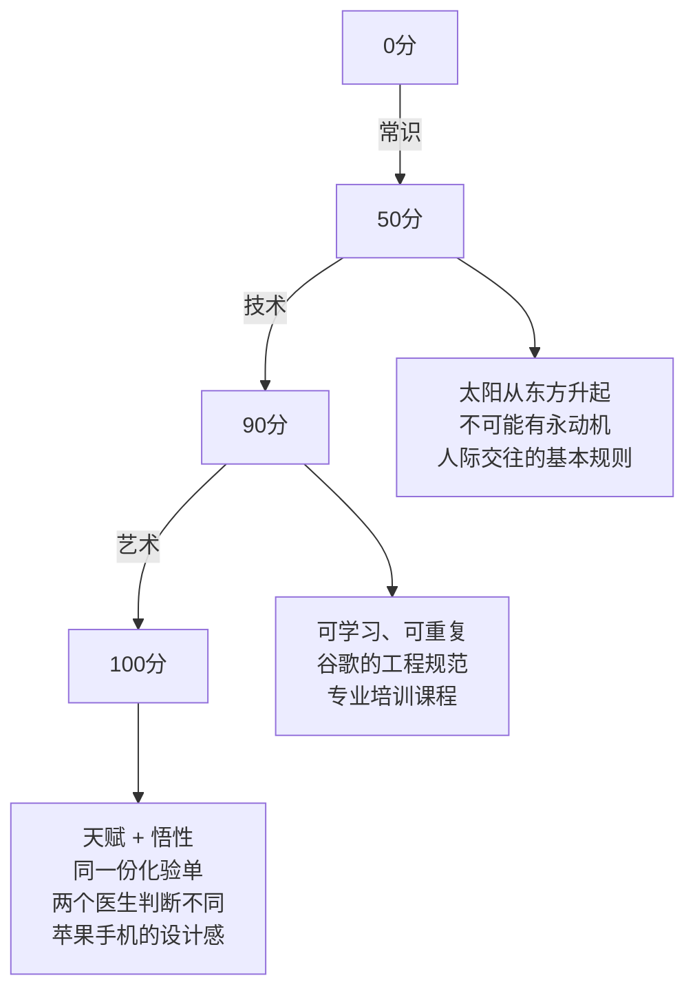
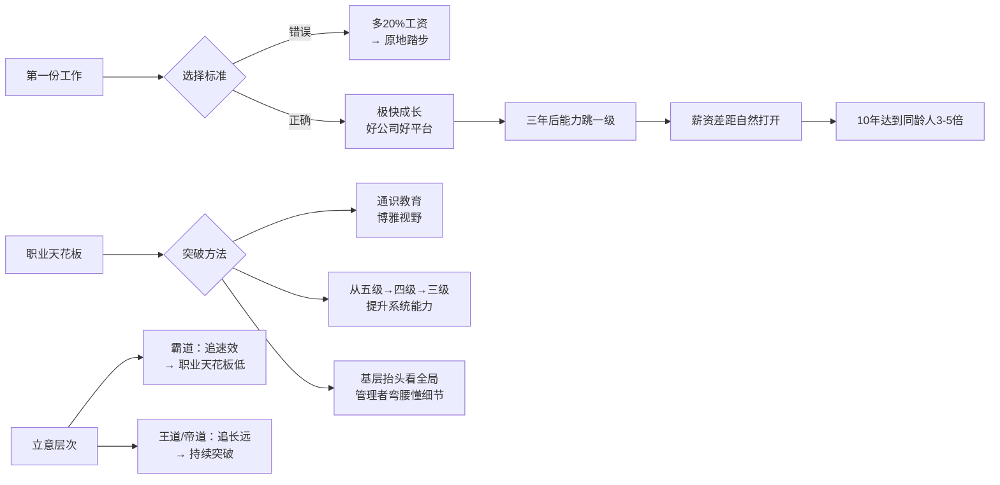

# 吴军职场方法论

吴军在《见识》第五章"职场的误区与破解方法"中，结合在谷歌和腾讯多年的管理与招聘经验，系统梳理了一套职业发展框架。全章约23000字，涵盖6个专题，从起点选择到天花板突破，形成完整路径。

## 第一份工作：不要太在乎工资

核心判断：**几乎没有人是靠第一份工作的工资发财的。**

吴军以北京名校研究生为例：30万年薪扣除税、社保、房租、餐饮、恋爱、父母，一年最多攒四五万，而北京一般地区一平方米房价就是这个数，还赶不上房价涨幅。同行业公司之间的薪资差距通常只有20%，这20%无法改变任何资产层面的命运。

**正确目标：** 第一份工作必须让你在10年后挣到同龄人或同班同学**3~5倍**的收入。实现路径是极快速地成长，养成良好的职业习惯，在最短时间里了解全行业。

**具体路径：**
- 毕业去谷歌、微软这类重视培养人的公司，三年后工程能力远超去百度、腾讯的同学
- 三年后凭能力跳槽到其他大公司，可以拿到高出同班同学一倍的薪酬
- 再次选择新公司时，依然以成长为标准，而非多20%的报酬
- 10年复利下来，3~5倍差距完全可达

**反面案例：** 某些人拿到谷歌offer后因雅虎多20%工资而拒绝，三四年后回来重新面试，职级比同班同学低了一级。在美国大部分人一生只能被提升两次，一开始就落后一级，代价巨大。

> "在乎20%工资的人比注重成长的人多，因此给有志气的人留下了机会。"

## 五级专业人士体系

吴军借用苏联物理学家**朗道**的等级体系（朗道将物理学家分5级，每级相差10倍，爱因斯坦是零级），改造为适用于所有专业人士的评价框架：

| 级别 | 核心能力 | 典型特征 |
|------|---------|---------|
| 五级 | 独立完成分配工作，不需他人指导 | 合格的应届毕业生起点 |
| 四级 | 将大问题化解为小问题，能带领他人 | 懂得在约束条件下找最优解（海湾大桥 vs 浮桥的判断力） |
| 三级 | 独立带人做出为公司盈利的产品 | 本身必须是非常好的产品经理；心胸开阔，接受各种意见 |
| 二级 | 做出先前没有的东西，世界因此有所不同 | 邓锋（发明网络防火墙）、杰夫·迪恩（谷歌云计算） |
| 一级 | 开创一个产业 | 爱迪生、贝尔、福特 |

吴军自评2.5级。每两级之间能力差约10倍，不是"差一点点"。

**为什么很多人遇到天花板：** 达到四级的人需要领导力和系统拆解能力，不是写程序熟练就够了；达到三级还需要市场判断和营销能力——"我就是做工程的，能不能挣钱我不清楚"这种态度，永远停在五级。

**四级的关键差异：** 能否分清"海湾大桥"和"浮桥"的不同目标。很多人把浮桥按海湾大桥的标准慢慢建，也有人把海湾大桥建成了浮桥。

## 职场4个误区与4个破法

### 误区一：工作和职业分不清

英语中 job 和 career 含义差别很大。工作是谋生手段，完成任务拿工资就两清了。职业是一辈子要从事的事业——要从医生提升为名医，要从工程师成长为能独当一面的管理者。

**后果：** 只做有报酬的事，凡是和职业发展无关但报酬高的事就做，凡是对职业有利但报酬低的事就不做，长期下来格局越来越小。

**专业态度：** 以工作目标的达成为中心，少受负面情绪影响，避免消极应付。当你做事变得非常专业时，同事只能用同样的专业态度与你打交道，即使有人不喜欢你，也不得不配合你做事。

### 误区二：把自己当过客而非主人

很多刚毕业的人把前一两家公司当跳板，心态上就是过客。一旦有了过客心态，很多该完成的工作不见了，也懒得建立和维护同事关系。结果是：既浪费了锻炼机会，又给同事留下坏印象。怀着这种心态的人即使跳槽，也难以被赋予重任。

### 误区三：被语言暴力激怒后乱了章法

语言暴力最大的危害：打击自信心，引诱你偏离工作重心。无论骂回去还是百般辩解，都让你疲于奔命，错失成功机会。

判断标准：采纳后对工作明显有利 = 善意批评；无理取闹 = 语言暴力。

### 误区四：疏于沟通

不打招呼，自己做主，指望生米做成熟饭让大家接受既成事实。结果是：即使想法和同事一致，对方也会故意鸡蛋里挑骨头。而提前沟通，对方未必一定反对，即使有意见也可以协调解决。

---

### 4个破法

**第一：为人谦卑。** 谦卑才能有效沟通，才能把注意力集中在事情本身。但谦卑不等于没有立场——"既谦卑又能把事情分析得入木三分的人，最让人钦佩。"

**第二：正确对待语言暴力。** 三步处理：
1. 先反省自己，是否是自己的过失
2. 确认是对方问题后，把周围人分三类：无关者（多数，不要卷入）、站我们这边的、施暴者
3. 搞清楚施暴者的目的——利益驱动就谈判，真正对立就主动沟通并发出声音

参考贝尔与格雷争电话专利案：打了十多年官司，贝尔胜诉后表示对方可以免费使用专利（宽容），但谁发明了电话这个是非问题，贝尔一步未让（原则）。**大度表现在指出错误后的宽容，而不是在是非问题上没有原则。**

**第三：明确工作的目的是自己的职业发展。** 不要被动地工作，拨一下动一下。想成为领导者，就要主动多做事情、多跟人打交道、帮助他人、支持团队。离开一个团队时，要留下点什么。

**第四：注重长期效益。** 把一件事放到两三年的周期来看待，对它的态度就会不同。

---

## 基层要抬头，管理者要弯腰

这是吴军对**职业员工**和**管理者**各自最典型的缺陷的总结。

### 基层员工：只看色块，不看全画

吴军用达利的《林肯》画作做比喻：眼睛贴近看，只能看到一个个色块；退后几步，才能看到林肯的侧脸。很多职业员工在成长过程中犯同样的毛病——对事物贴得太近，忽略了整幅画。

**案例一：** 一位视频领域资深工程师，不知道自己产品的广告点击率范围，不知道30分钟视频被观看一次能挣多少广告费。他的产品不能盈利，最终只有三种结局：产品被砍/换岗、失业、公司因亏损关门。三种都是坏结局。

**案例二：** 一位资深专利律师，不了解自己公司专利的平均批准周期，给出的回答是"不知道，这要找专利局的人去了解"——对自己工作的总体情况不了解，是典型的只见树木不见森林。

**最有效的沟通方式：** 第一时间直接给出答案，然后补充解释。不是先铺垫一堆背景。

> 某次12个项目路演，9个创始人花5~6分钟介绍背景，8分钟结束了评委还不知道他们要做什么。

### 管理者：只看全局，不了解细节

奥本海默负责曼哈顿计划，无数诺贝尔奖得主在他手下工作，他们一致认为奥本海默是最好的老板，原因之一：他了解几乎每一个细节，即便他并没有亲自动手。韦尔奇也有同样的特点。

**实际危害：** 一个总监为了扩大自己的队伍（个人利益），把20人扩到50人，而95%的事情有开源软件可以解决。管理者不了解细节，就无法识别这种内耗。

> "有效的管理者如果做到第5级（基层是第1级），需要了解第3级的工作；做到第6级，需要了解第4级的工作。"

一句话总结：**基层员工要抬起头，管理者要弯下腰。**

## 帝道、王道与霸道：突破职业天花板

### 商鞅游说秦孝公的寓言

商鞅三次见秦孝公：第一次讲帝道（尧舜禹），孝公睡着；第二次讲王道（文武王），有点兴趣；第三次讲霸道（五霸），孝公身体前倾，拍板任用。

结果：商鞅为秦国制定功利性法律，短期奏效，但商鞅自己说过："这样一来，国运终究不可能超过商朝和周朝。" 暴秦统一中国后20年灭亡，孝公宗室遭灭族。

**应用到职场：** 追求速效的"霸道"（某专业能挣钱就涌入→供过于求→回报骤降）是最常见的立意错误。外贸、金融数学都经历过这个周期。

### 突破天花板的根本路径：通识教育

哈佛、普林斯顿等顶级名校的人文教育毕业生，起薪不如工科毕业生，但**10年后反超**，社会地位提升更快。原因是视野更宽，能调动更多资源，更容易突破天花板。

欧美发达国家大学生从毕业到退休平均只有**两次**升迁机会，中国随着成熟化也在趋同。所以：

> "求其上者得其中，求其中者得其下。"

吴军的批评：很多人口头上叹息中国没有通识教育，实际上却拒绝关注自己领域之外的知识，认为那是浪费时间。叶公好龙而已。

## 职场进阶的三层结构

**三层关系：**
- **常识：** 千百年验证的经验和基础认知。违背常识的理论（水变汽油、金融游戏让所有人富裕），大概率是骗局。成功学书籍有用的部分是常识，能帮你做到50分。
- **技术：** 具有可重复性，可以通过学习掌握。严格遵守流程，能保证稳定的输出质量。帮你从50分做到90分。
- **艺术：** 靠天赋，无法线性传授。同一份化验结果，有的医生判断准，有的不准——这个差距已经超出了技术范畴。苹果手机技术指标不如同价格华为，但使用体验更流畅——是技术之外那点艺术在起作用。

**结论：** 凡事做到90分，通过努力都能达到；是否能做到100分，因人而定，可遇不可求，不必有负担。

## 职业发展路径图

