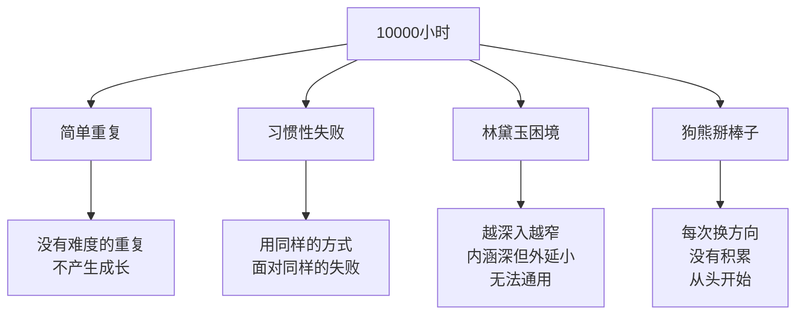
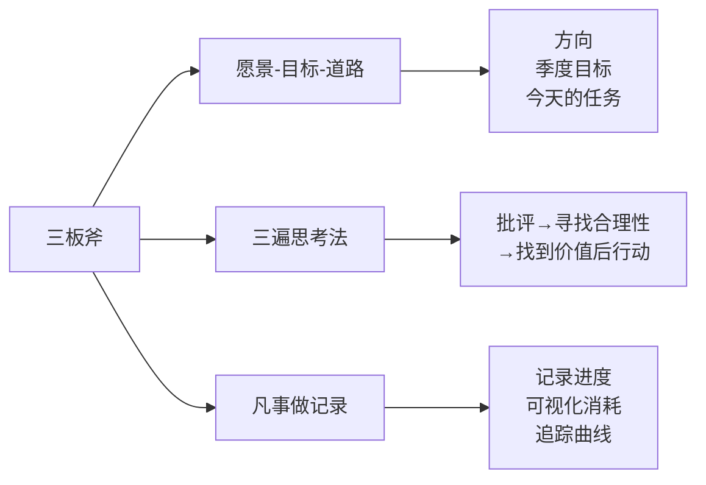

# 拒绝伪工作

"伪工作"（pseudo work）是吴军在[[见识]]中提出的概念，指那些让人看起来很忙、实际上对目标没有贡献的工作。雅虎衰落的一个重要原因，就是整个公司陷入了伪工作的泥潭——每个人都很忙，但公司的核心业务却在持续萎缩。谷歌内部曾将这类员工称为"fake worker"。

## 伪工作的六大特征

伪工作不容易被自我识别，因为它通常伴随着忙碌感和充实感：

- 做的事情没有明确的目标，或与公司的核心目标无关
- 反复做同一件事，没有积累和提升
- 工作结果无法衡量，也无人追责
- 用开会、汇报代替实际产出
- 用流程和规范掩盖执行力不足
- 以苦劳作为业绩依据，而非功劳

## 10000小时的四大误区

刻意练习理论认为，10000小时的专注练习可以成就专家。但吴军指出，大多数人的10000小时其实是无效的：

**简单重复**：只重复已经会的内容，不进入"学习区"，没有成长。

**习惯性失败**：用同样的方式面对同样的挑战，屡败屡战但从不改变策略。

**林黛玉困境**：越钻越深，越来越专，但专业的内涵越深，适用的外延越窄，失去了通用性。

**狗熊掰棒子**：频繁转换领域，每次都重头开始，没有任何积累，十年如一日停在起点。

## 三板斧：摆脱伪工作的操作方法

吴军总结了三个可执行的工作方法，称为"三板斧"：

**愿景-目标-道路**：在任何时刻，都要清楚三个层次：长期方向（愿景）、阶段性目标（OKR周期内的目标）、今天要做的具体事情（道路）。三者缺一，工作就会漂移。

**三遍思考法**（听不中听的话找合理性）：第一遍听到批评或建议，先找到"对方说得有道理的部分"；第二遍理解对方的完整意图；第三遍决定是否采纳、如何行动。不要在第一遍就否定或全盘接受。

**凡事做记录**：每天记录自己的工作内容和进度，形成"消耗追踪曲线"，可视化任务推进状态。写下来不仅是为了记忆，更是为了强迫自己在事前想清楚、事后有据可查。

## OKR：谷歌目标管理法

吴军在谷歌亲历的 OKR（Objectives and Key Results）是防止伪工作系统性蔓延的组织工具：

- **O（Objective）**：季度性目标，方向性的、有挑战性的，通常设定在"努力才能达到"的水平
- **KR（Key Result）**：可量化的关键结果，每个 O 对应 2-5 个 KR
- **打分**：0-1 分，0.7-0.8 是正常水平。满分反而说明目标设得太低；低于 0.5 才需要反思执行问题
- **公开性**：谷歌的 OKR 公开在公司内网，任何员工可以查阅任何同事和高管的 OKR
- **季度制**：每季度重新制定，不跨周期积累

OKR 的核心不是"完成目标"，而是"设定有意义的目标"。一个没有挑战性的 OKR，比没有 OKR 更危险——它合法化了伪工作。

## 做好最后的 1%

吴军用三个案例说明"最后 1% 的重要性"：

**运动会点卯故事**：某次运动会，参赛选手接近终点时停下来等待，因为以为比赛已经结束。这一停，名次从第一变为最后。很多人在工作中有类似的心态——"差不多就行了"，但差 1% 往往意味着输赢的全部。

**瑞士制造精神**：瑞士钟表、刀具等产品在全球高端市场的竞争力，源于对最后 1% 品质的执着。"比竞争对手好 5%"，就能在高端市场形成不可替代的地位。大部分人在 95% 时就停下，只有少数人走完 100%。

**高盛确认文化**：高盛要求每一笔重要交易在口头确认后，还必须有书面确认。流程的最后 1% 不是形式，而是风险管控的关键节点。口头确认完成后还没有发出确认邮件，交易等于没有完成。

> "一件事情做到 95% 和做到 100%，在结果上有时天差地别。"

## 应用小结

识别自己是否在做伪工作，最简单的测试是问：**如果我不做这件事，公司或项目会有什么不同？** 如果答案是"大概没什么影响"，那就是伪工作。

伪工作的对立面不是"更努力工作"，而是"更清楚地知道什么值得做"。三板斧、OKR、最后 1%，都是帮助回答这个问题的工具。
