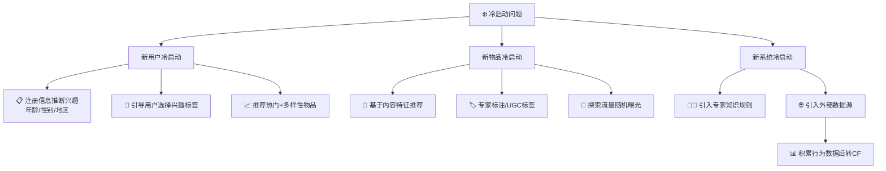
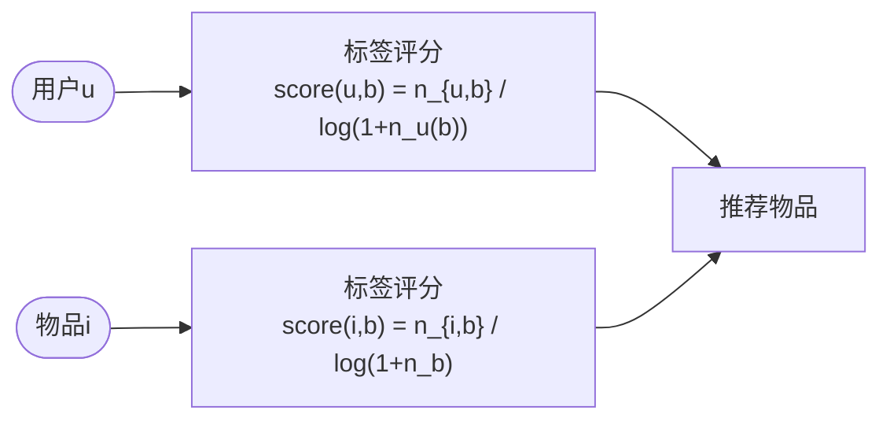

# 推荐系统工程实践

本文涵盖推荐系统在实际落地中需要解决的工程问题，包括冷启动、标签系统、上下文感知推荐、社交网络推荐，以及系统架构设计。

## 冷启动问题

冷启动（Cold Start）是推荐系统在缺乏用户行为数据时如何提供有效推荐的问题。分为三类。

### 三类冷启动场景及解决方案



**用户冷启动**：新用户没有历史行为，无法进行个性化推荐。

**物品冷启动**：新物品刚上线时，没有用户对其产生行为，无法被协同过滤算法推荐。在新闻等时效性强的网站中尤为突出。

**系统冷启动**：全新网站，既没有用户数据也没有物品行为数据。

### 解决方案

#### 利用用户注册信息（用户冷启动）

通过年龄、性别、国籍、职业等人口统计学特征对用户分类，推荐同类用户中最热门的物品。

推荐公式（基于特征 f 对物品 i 的兴趣）：

```
p(f, i) = |{u ∈ N(i) | u 具有特征 f}| / (|N(i)| + α)
```

分母加 α 用于解决数据稀疏问题（避免只被一个具有特征 f 的用户评价的物品获得虚高权重）。

Lastfm 数据集实验表明，融合的人口统计学特征越多，推荐精度越高：

```
DemographicMostPopular > CountryMostPopular > AgeMostPopular
> GenderMostPopular > MostPopular
```

其中国家特征对音乐兴趣预测的影响最大（中美两国年轻人的音乐偏好差异显著）。

#### 利用社交账号导入（用户冷启动）

新用户通过微博、Facebook 登录时，经用户授权导入好友关系和行为数据，直接应用社会化推荐。

#### 要求用户对物品反馈（用户冷启动）

在用户首次登录时，让用户对精心挑选的物品进行评分，再根据反馈做个性化推荐（Jinni 电影推荐网站采用此方式）。

**选择启动物品的原则**：
1. 物品要比较热门（用户知道它们是什么）
2. 具有代表性和区分性（不能是老少咸宜的大众化物品）
3. 集合需要多样性（覆盖尽量多的兴趣方向）

可以用决策树算法（Nadav Golbandi 提出）来选择最具区分度的物品序列：

```
区分度 D(i) = Var(U_like(i)) + Var(U_dislike(i)) + Var(U_unknown(i))
```

选择能让三类用户集合内部方差最小（即各群体兴趣最一致）的物品作为启动物品。

#### 利用物品内容信息（物品冷启动）

对于新物品，基于内容相似度（TF-IDF + 余弦相似度）将其推荐给喜欢内容相似旧物品的用户：

```python
def CalculateSimilarity(entity_items):
    w = dict()
    ni = dict()
    for e, items in entity_items.items():
        for i, wie in items.items():
            ni[i] = ni.get(i, 0) + wie * wie
            for j, wje in items.items():
                w.setdefault(i, {})
                w[i][j] = w[i].get(j, 0) + wie * wje
    for i, related_items in w.items():
        related_items = {x: y / math.sqrt(ni[i] * ni[x])
                        for x, y in related_items.items()}
```

MovieLens/GitHub 对比实验表明：ContentItemKNN 的准确率低于 ItemCF，但覆盖率相近。在实际系统中，内容过滤主要用于冷启动，协同过滤用于主推荐流。

## 基于标签的推荐

标签（Tag）是描述物品语义的关键词，UGC（用户生成内容）标签系统既描述用户兴趣，又表示物品内容，是联系用户和物品的纽带。代表应用：Delicious、Last.fm、豆瓣、Hulu。

### 用户标注行为特征

用户标注行为（用户、物品、标签）的三元组数据满足以下统计规律：
- 标签流行度符合**长尾分布**（Power Law）
- 不同类型的标签：表明物品是什么、物品种类、用户观点、用户任务等

### 基于标签的物品推荐

**SimpleTagBased 算法**：

```
p(u, i) = Σ_{b ∈ B(u) ∩ B(i)} n_{u,b} * n_{b,i}
```

其中 n_{u,b} 是用户 u 打标签 b 的次数，n_{b,i} 是物品 i 被打标签 b 的次数。

### 标签推荐管道



```python
def Recommend(user):
    recommend_items = dict()
    tagged_items = user_items[user]
    for tag, wut in user_tags[user].items():
        for item, wti in tag_items[tag].items():
            if item in tagged_items:
                continue
            recommend_items[item] = recommend_items.get(item, 0) + wut * wti
    return recommend_items
```

**改进一：TagBasedTFIDF（惩罚热门标签）**

借鉴 TF-IDF 思想，降低热门标签的权重：

```
p(u, i) = Σ_{b} (n_{u,b} / log(1 + n_u^b)) * n_{b,i}
```

其中 n_u^b 是使用标签 b 的用户数。实验表明 TagBasedTFIDF 在所有指标上均优于 SimpleTagBased。

**改进二：TagBasedTFIDF++（同时惩罚热门物品）**

进一步对热门物品降权，避免推荐系统总是推荐热门物品。

**改进三：标签扩展**

对使用标签较少的用户，计算标签之间的相似度并扩展用户的标签向量：

```
sim(b, b') = |items(b) ∩ items(b')| / sqrt(|items(b)| * |items(b')|)
```

**改进四：标签清理**

- 去除高频停止词
- 合并因词根不同造成的同义词（recommender system / recommendation system）
- 合并因分隔符造成的同义词（collaborative_filtering / collaborative-filtering）

### 标签推荐

当用户给物品打标签时，系统推荐合适标签的方法：

| 算法 | 描述 | Delicious 准确率 |
|------|------|----------------|
| PopularTags | 全局最热门标签 | 7.32% |
| UserPopularTags | 用户自己最常用的标签 | 11.84% |
| ItemPopularTags | 物品上最热门的标签 | 23.80% |
| HybridPopularTags (α=0.8) | 线性融合 User+Item | 25.15% |

```python
def RecommendHybridPopularTags(user, item, user_tags, item_tags, alpha, N):
    ret = {}
    max_u = max(user_tags[user].values())
    for tag, w in user_tags[user].items():
        ret[tag] = (1 - alpha) * w / max_u
    max_i = max(item_tags[item].values())
    for tag, w in item_tags[item].items():
        ret[tag] = ret.get(tag, 0) + alpha * w / max_i
    return sorted(ret.items(), key=itemgetter(1), reverse=True)[0:N]
```

实验结论：ItemPopularTags 优于 UserPopularTags，原因是用户给一本武侠小说打标签时参考的是该书的常用标签，而非自己给其他编程书打的标签。

### 豆瓣的标签推荐解释实践

豆瓣读书将标签云展示给用户，用标签作为推荐解释的中间层：
1. 展示标签云（用户兴趣分布），让用户选择当前感兴趣的标签
2. 展示该标签下的推荐物品

优势：将"推荐解释的合理性"分解为两个更简单的问题（标签准确性 + 标签-物品相关性），提高用户信任度。

研究表明：**客观事实类标签**（sci-fi、world war II）优于主观感受类标签（funny、poignant）作为推荐解释。

## 上下文感知推荐

上下文（Context）是用户所处的环境信息，包括时间、地点、心情等，显著影响用户的即时兴趣。

### 时间上下文

**时间效应的三种类型**：
1. **用户兴趣随时间变化**：随年龄增长、工作变化等自然演化
2. **物品生命周期**：新闻生命周期短，电影生命周期相对较长
3. **季节效应**：冰淇淋夏季热销，圣诞节附近手机和巧克力的搜索量明显上升

**实时性要求**：优秀的推荐系统需要实时响应用户新行为（亚马逊在几十秒内更新推荐列表）。

**推荐算法的时间多样性**：每天给用户的推荐结果变化程度。实验表明：高时间多样性不一定提高用户满意度，纯随机推荐虽然时间多样性最高，但精度低，用户满意度反而下降。

**TUserCF（融合时间信息的 UserCF）**：

在用户相似度计算中加入时间惩罚：

```python
# 计算相似度时，行为时间越接近，贡献越大
C[u][v] += 1 / (1 + alpha * abs(tui - tvi))
```

在推荐时，近期行为权重更高：

```python
rank[i] += wuv / (1 + alpha * (T - tvi))  # T 为当前时间
```

**系统时效性分析方法**：
- 物品平均在线天数（流行度相同时，NYTimes 文章的在线天数远短于 Wikipedia 词条）
- 相隔 T 天的物品流行度向量余弦相似度（相似度衰减越快，时效性越强）

**时间段图模型（SGM）**：

在用户—物品二分图基础上增加时间节点，通过路径融合算法计算用户与物品的相关度。路径权重公式：

```
ω(path) = Π_{v' ∈ path} γ(v') / |out(v')|
```

其中 γ(v') 是顶点权重（用户时间节点与物品时间节点具有不同权重参数），|out(v')| 是出度。

实验结论：在时效性强的数据集（博客、YouTube、NYTimes）上，融合时间信息的算法（SGM、TUserCF）明显优于不考虑时间的算法。在时效性弱的数据集（Wikipedia、SourceForge）上，差距不明显。

### 地点上下文

**兴趣本地化**：不同地区用户的兴趣有明显差异（如德国用户和美国用户喜欢的音乐人大相径庭）。

**活动本地化**：45% 的用户活动范围半径不超过 10 英里，75% 不超过 50 英里。

**LARS（位置感知推荐系统）** 的两种场景：

1. **用户有位置属性（如邮编）**：金字塔模型，按地理层级（国家→省→市）逐层建立推荐模型，加权融合：

```
FinalRec(u) = Σ_level weight_level * ItemCF_level(u)
```

2. **物品有位置属性（如餐馆）**：在协同过滤基础上加 TravelPenalty：

```
RecScore(u, i) = P(u, i) - TravelPenalty(u, i)
```

TravelPenalty 取物品 i 与用户历史访问地点的平均距离。

## 社交网络推荐

社会化推荐的价值：尼尔森调查显示 90% 的用户相信朋友推荐，好友推荐可以显著提高用户信任度和推荐结果的接受率。

### 基于邻域的社会化推荐

用户 u 对物品 i 的兴趣：

```
p(u, i) = Σ_{v ∈ out(u)} sim(u, v) * r(v, i)
```

相似度综合考虑两个因素：
- **熟悉程度（Familiarity）**：共同好友比例
  ```
  familiarity(u, v) = |out(u) ∩ out(v)| / sqrt(|out(u)| * |out(v)|)
  ```
- **兴趣相似度（Similarity）**：共同喜欢的物品比例（类似 UserCF）
  ```
  similarity(u, v) = |N(u) ∩ N(v)| / sqrt(|N(u)| * |N(v)|)
  ```

### 好友推荐算法

| 方法 | 思路 |
|------|------|
| 基于共同好友 | 推荐好友的好友（e-Friend of Friend） |
| 基于共同兴趣 | 推荐兴趣相似的陌生人 |
| 基于潜在好友 | 挖掘社交网络中隐含的关系 |

用户调查结论（Jilin Chen 的研究）：
- SocialBased 推荐的好友更多是用户认识的（55.4% vs InterestBased 19.5%），用户满意度更高
- InterestBased 推荐的好友新颖度更高（更多用户不认识但有共同兴趣的人）
- 融合两者（Interest+Social）在满意度和新颖性上取得平衡

### 社会化推荐的局限

- 基于社交图谱（Facebook 类）的推荐中，好友关系不一定基于共同兴趣，离线精度不一定提升
- 基于兴趣图谱（Twitter 类）的推荐效果更好
- 社交网络最大价值在于提升用户对推荐结果的信任度，而非精度

## 系统架构：推荐引擎设计

推荐系统由多个推荐引擎组成，每个引擎负责一类特征和一种策略。

### 整体架构

```
用户 → 流量分配 → 多个推荐引擎（并行） → 结果合并/排序 → 推荐列表
                ↑
           日志系统 ← 用户行为
```

多引擎架构的优势：
- 灵活增减引擎，通过配置文件控制各引擎权重
- 支持引擎级别的用户反馈（不同用户偏好不同推荐策略）

### 推荐引擎的三个模块

**模块 A：生成用户特征向量**

从行为中提取特征时需考虑：
- 行为种类（购买 > 收藏 > 浏览）
- 行为时间（近期行为权重更高）
- 行为次数（听歌次数越多，权重越高）
- 物品热门程度（对冷门物品的行为更能反映个性）

**模块 B：特征-物品相关推荐**

离线相关表存储格式（MySQL）：

| src_id | dst_id | weight |
|--------|--------|--------|
| 特征ID | 物品ID | 权重   |

支持配置多张相关表（协同过滤 + 内容过滤）并加权融合，在线服务启动时加载到内存。

**模块 C：过滤与排名**

- 过滤用户已消费过的物品
- 过滤不在候选物品集合中的物品（如只推荐最新上线的物品）
- 对候选集进行重排序（加入多样性、新颖性、商业需求等因素）

### 数据存储策略

| 数据类型 | 存储介质 | 特点 |
|----------|----------|------|
| 购买、收藏、评分等 | 数据库 + 缓存 | 需要实时存取 |
| 浏览、搜索记录 | 分布式文件系统（HDFS） | 大规模、非实时 |
| 离线相关表 | MySQL + 内存 | 定期更新，在线查询 |

推荐系统的实时性核心：能否及时获取用户的新行为数据，从而实时调整推荐结果。ItemCF 在用户产生新行为后可立即更新推荐列表，LFM 则只能离线批量计算（见 [[协同过滤算法]]）。
