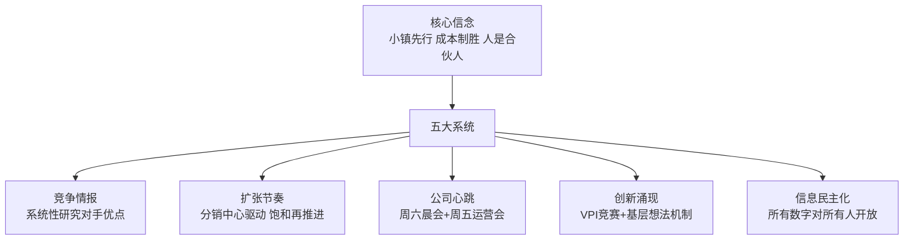
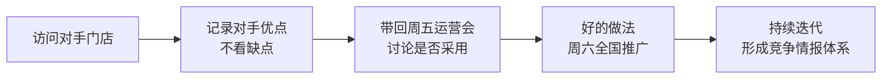
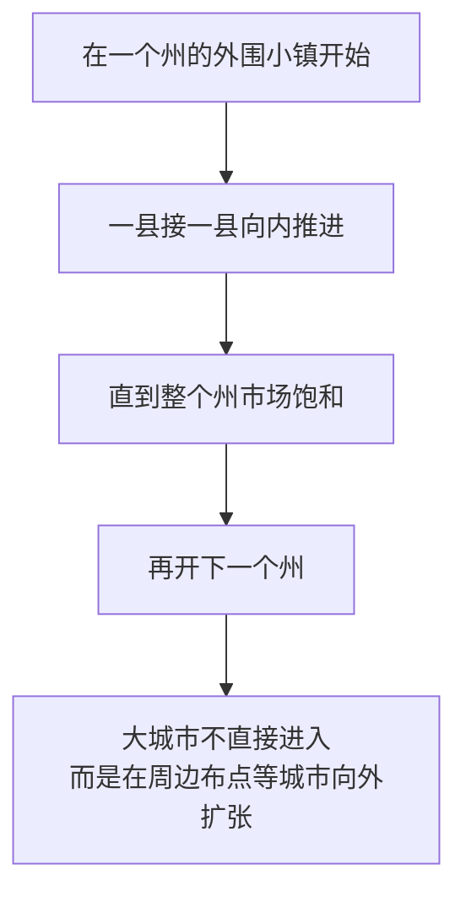
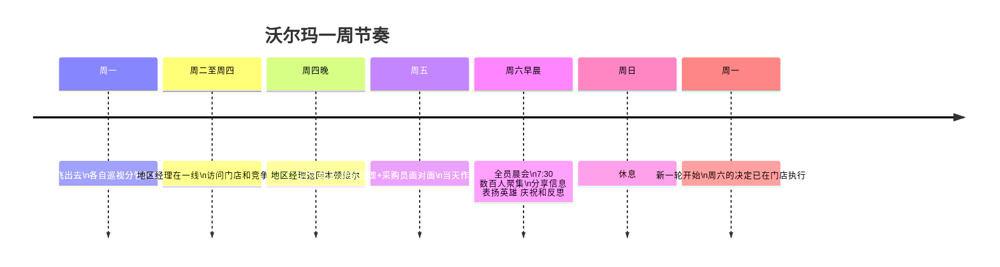

# 沃尔玛经营哲学

> 来源：《[[富甲美国]]》——萨姆·沃尔顿自传（1992）

---

## 框架总览

萨姆·沃尔顿没有受过 MBA 教育，没有战略顾问，也没有读过多少管理书籍。他的方法论全部来自实践：从竞争对手的垃圾桶里翻价格情报，在停车场铺油桶充当临时停车场，在宣布成为美国首富之后继续开破旧皮卡。

但这套从实践中涌现的方法，包含了几个在当时零售业极为稀有的管理思想。

---

## 一、竞争哲学：向对手学习，而非击败对手

多数公司研究竞争对手是为了找到对方的弱点加以攻击。萨姆的做法相反：**只关心对手做对了什么**。

> "去研究一下我们的竞争对手吧！不要专挑别人的短处，要找别人的长处。如果你找到别人的一个优点，那就是比你商店所进的商品更好的东西，我们必须试图把这个优点与我们的公司结合起来。"

**具体操作：**

- 每个地区经理每周外出巡店时，必须访问竞争对手的门店，不只是自家的门店
- 早期店员会在竞争对手关门后翻对方的垃圾桶，记录价格情报
- 萨姆本人从纽波特时期起就每天过马路进对手的斯特林商店溜达，研究陈列和定价

**更深的竞争逻辑：**

萨姆把竞争对手视为免费的管理顾问。凯马特的哈里·坎宁安（建立了第一家折扣商店）被他称为"这个时代的主要零售商之一"，尽管他们是直接竞争对手。这种对竞争者的真心尊重，反而让他比大多数人更早、更准确地感知到行业变化。

---

## 二、扩张战略：物流约束驱动的饱和推进

沃尔玛的扩张看起来是"占领小镇"，但背后有一条硬约束：**每家门店必须在一个分销配送中心一天车程（约350英里）之内**。这个约束不是保守，而是系统性的竞争优势。

**"从外向内填满"的逻辑：**

**为什么这个顺序有效：**

1. **广告成本几乎为零**：75家店密布阿肯色州，口耳相传就能覆盖，不需要媒体投放
2. **竞争对手没有意识到威胁**：凯马特看到的是"阿肯色的乡巴佬"，不是威胁。等他们进入密苏里时，已经面对40家沃尔玛的包围网
3. **配送效率形成护城河**：自有仓库和卡车车队，85%的商品从自有仓库发货，订单到补货平均2天（行业平均5天以上）

**飞机选址：领先行业10年的信息优势**

萨姆从1950年代就亲自驾驶小飞机低空勘察。从空中能看清交通流向、城镇扩张方向和竞争格局。前400多家门店的选址几乎全部经过他的飞行勘察。他称这比任何房地产顾问都准——"要是没有那架飞机，所有这些事是不可能做成功的"。

---

## 三、公司心跳：以会议为骨架的周节奏

沃尔玛的运营节奏由两个固定会议驱动，形成了一个**一周内完成信息采集、决策和执行**的完整闭环：

**周五运营会议的独特价值：**

它强制让两个天然对立的群体每周面对面：地区经理（经营视角）和采购员（商品视角）。前者抱怨商品不对，后者抱怨执行不力——而这个张力每周在会议上释放一次，当天解决。

> "我们有一条准则，我们从不让某一事项悬而不决。即使是错误的，我们在会议中也要作出一种决策。一旦我们在星期五作出了决策，我们希望所有商店在星期六就予以执行。"

**周六晨会的三个目的（萨姆原话）：**

1. 交流信息
2. 减轻每个人的负担
3. 团结队伍

会议没有固定议程，可能有健美操、拉拉队口号、吐柿籽比赛，也可能有杰克·韦尔奇（通用电气CEO）来做客，或者萨姆被迫当场学草裙舞。**不可预知性是刻意设计的**——正因为员工不知道接下来会发生什么，他们才会保持注意力和期待感。

---

## 四、创新涌现机制：让想法从基层冒出来

沃尔玛最好的管理创意几乎全部来自基层，而非总部。萨姆的工作是**创造让想法向上流动的结构**。

**VPI（Volume Producing Item）竞赛：**

每个部门经理可以选一个商品大力促销，制作创意陈列，争取最高销量。获胜的想法在周六晨会全国传播。萨姆对这个机制的评价：不只是刺激销售，更是教导员工"如何成为好零售商"——选品、定价、陈列的综合判断力。

**迎宾员的诞生（基层创新典型案例）：**

1980年，萨姆走进路易斯安那克罗利的一家门店，看到一位年长员工在门口主动问候顾客。这个经理是为了防止盗窃，但萨姆立刻意识到这同时是绝佳的顾客体验。他回到本顿维尔宣布全国推广，遭到几乎所有人的反对（"这是浪费人力成本"）。他花了一年半时间逐会议逐会议地坚持，每次走进没有迎宾员的门店就发火，最终全部门店落实。1989年，他在凯马特门口看到了迎宾员。

**"是的萨姆，我们能够"计划：**

鼓励员工提出节省成本的想法，每年从中节省约800万美元。其中他最喜欢的一条：运输部门一位员工发现公司拥有全美最大私人卡车车队，却花钱雇第三方运输公司运进货——她找到了用自有卡车回程运货的方案，一次节省50多万美元。

---

## 五、销售驱动 vs 运营驱动

这是萨姆明确表述的零售哲学核心：

> "在零售业中，你要么是以经营驱动的——这种情况下你的主要推动力是减少经营费用和提高效率——要么是以销售驱动的。那些真正以销售驱动的零售商总是能够改善经营状况。但是，那些以经营驱动的零售商却往往业绩平平并开始衰退。"

早期沃尔玛用VPI促销竞赛弥补了采购计划不精细、商品结构不完善的缺陷——用销售激情弥补了系统性不足。这个原则后来被制度化：每个部门经理是销售者而非管理者，每个采购员每季度必须"吃吃自己做的菜"——去自己采购的商品部门当几天经理。

---

## 六、信息民主化：数据是给员工的，不是留在总部的

沃尔玛的卫星系统（1983年上线，2400万美元）最终产生的最大价值不是通讯，而是信息的内部流动速度：

- 商店经理每天能看到自己的销售数字、库存状况和损益报表
- 部门经理拿到商品的成本、运输费用和利润数据——这在当时极为罕见
- 地区经理能在周五运营会前看到全周的数字，带着具体数据与采购员辩论

> "情报就是力量，你把这份力量给予你的同事后所得到的益处将远远超出消息泄漏给竞争对手所带来的风险。"

**与传统零售商的对比：**
多数连锁零售商把财务数据视为管理层特权，门店经理只知道自己的销量，不知道成本结构，无法做商业判断。沃尔玛让部门经理看到"如果这个商品卖了多少件、利润是多少"——这是"店中有店"赋权机制能够运转的信息基础。

---

## 七、成本结构作为护城河

沃尔玛的价格优势不来自压榨供应商，而来自**自身运营成本比任何竞争对手都低**：

| 成本项目 | 沃尔玛 | 行业水平 |
|---------|--------|---------|
| 一般管理费用/销售额 | ~2% | ~5% |
| 商品配送成本/销售额 | <3% | 4.5-5% |
| 从订单到补货 | ~2天 | 5天以上 |

**2%管理费用原则的历史：**

从纽波特的5家本·富兰克林商店时代就确立，到2000亿美元销售额从未更改。萨姆说这个数字是"凭空想出来的"——他只是决定比行业标准（5%）低一半，然后让所有人围绕这个约束想办法。

这个约束产生了一系列连锁行为：
- 办公室从不装修（总部像"卡车终点站的司机休息室"）
- 出差1%原则（出差费用不超过采购额的1%）
- NYC采购团队住最便宜的旅馆、步行不打车
- 反对官僚：每隔一段时间就要划一条线，把机构精简回去

---

## 与知识库其他框架的对比

| 维度 | 沃尔顿（零售/文化）| [[高产出管理]]（格鲁夫/Intel）|
|------|-----------------|--------------------------|
| 信息流动 | 数据对所有人开放；卫星广播 | 一对一会议；管理报告 |
| 会议设计 | 周六晨会：娱乐+信息+决策三合一 | 操作复盘会：纯信息效率导向 |
| 创新来源 | 基层员工想法向上涌现 | 技术+管理双通道 |
| 成本纪律 | 2%管理费用硬约束 | 杠杆率：单位时间产出最大化 |
| 竞争态度 | 向竞争对手学习优点 | 偏执者才能生存 |

→ 参见：[[AI思维伙伴框架]]（信息赋权的现代形式）
