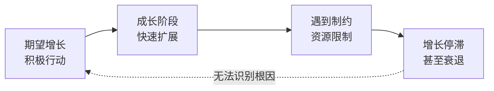
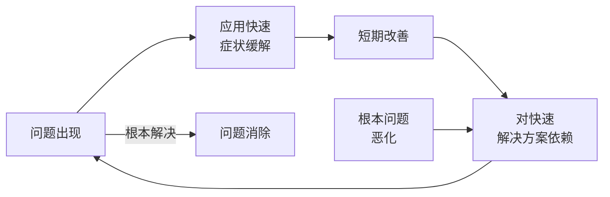

# 系统思考

## 定义

系统思考是**识别支配事件、行为和结果的模式和结构**的能力。不是聚焦于孤立的问题或事件，而是理解它们所嵌入的系统整体。

## 核心原理

### 三个基本积木块

系统行为由三种基本要素构成：

**正反馈（Reinforcing Loop）**
- 自我增强的循环
- 增长或衰退的过程
- 一旦启动，倾向于加强自身
- 例：成功 → 信心增强 → 更多行动 → 更大成功

**负反馈（Balancing Loop）**
- 寻求稳定的循环
- 产生抵抗力和制约
- 维持系统在目标附近
- 例：过热 → 身体出汗 → 温度下降 → 恢复平衡

**延迟（Delay）**
- 因果之间的时间间隔
- 导致系统响应的迟钝
- 使因果关系难以被察觉
- 例：政策改变 → 市场反应需要 6 个月

### 系统思考的11条法则

1. **今天的问题来自昨天的"解决方法"** — 快速修复产生新问题
2. **越使劲儿推，系统的反弹力越大** — 系统产生抵抗
3. **情况变糟之前会先变好** — 延迟效应
4. **选择容易的办法往往会无功而返** — 最优解常违反直觉
5. **疗法可能比疾病更糟糕** — 症状救济强化根本问题
6. **快就是慢** — 缓进胜于急功近利
7. **因和果在时空中并不紧密相连** — 因果隐藏于复杂
8. **微小的变革可能产生很大的成果** — 杠杆点的力量
9. **鱼和熊掌可以兼得，但不是马上** — 短期与长期权衡
10. **把大象切成两半得不到两头小象** — 整体大于部分之和
11. **不去责怪** — 所有人都是系统参与者

## 基本系统模式

### 增长极限（Limits to Growth）



**特征**：
- 初期快速增长
- 突然停滞或衰退
- 人们常误以为是外部攻击

**原因**：
- 资源有限（人员、资金、材料）
- 质量下降导致客户流失
- 市场饱和
- 管理能力不足

**应对**：
- 识别真正的制约因素
- 突破制约而非过度施压

### 转移负担（Shifting the Burden）



**特征**：
- 快速修复带来暂时缓解
- 长期问题加剧
- 组织对救急措施形成依赖

**常见例子**：
- 加班来赶工期（不改进流程）
- 裁员来削减成本（不提升效率）
- 补偿来应对客户不满（不改进产品）

**陷阱**：
- 症状缓解强化对根本原因的忽视
- 形成"药物依赖"
- 最终陷入恶性循环

## 杠杆点（Leverage Points）

微小的改变在正确的地方可能产生巨大的成果。关键是找到系统中的"杠杆点"。

### 杠杆点的特征

- 不显眼（常被忽视）
- 不直观（违反直觉）
- 需要系统思考才能识别
- 效果常在延迟后才显现

### 识别杠杆点的方法

1. **跟踪信息流** — 信息的获取和流动决定行为
2. **寻找反馈延迟** — 长延迟点是高杠杆点
3. **观察参与者的心智模式** — 思维假设决定决策
4. **分析激励结构** — 奖惩制度塑造行为

## 应用实例

### 企业管理

**问题**：销售不畅
- 表面原因：销售团队不努力
- 系统原因：产品质量问题、市场定位错误、竞争加剧
- 杠杆点：改进产品工程、重新定位市场而非简单激励销售

### 教育

**问题**：学生成绩下滑
- 表面原因：学生不用功
- 系统原因：教学方法陈旧、学生缺乏内在动机、课程设计脱离现实
- 杠杆点：改变评估方式、激发学生的真实兴趣、重设课程内容

### 环境

**问题**：污染加重
- 表面原因：工厂排污
- 系统原因：成本外部化、缺乏规制、消费者需求驱动
- 杠杆点：改变价格机制使污染成本内部化、改变消费模式而非简单限制排污

## 与其他修炼的关系

系统思考是第五项修炼，为其他四项修炼提供基础框架：

- **自我超越**：理解个人欲望与现实的系统互动
- **心智模式**：识别假设如何塑造系统感知
- **共同愿景**：理解愿景与现实的系统关系
- **团队学习**：在团队讨论中应用系统思考工具

## 学习与实践

### 工具

- 因果图（Causal Diagrams）
- 库存流量图（Stock and Flow Diagrams）
- 系统动力学模型（System Dynamics Models）
- 情景规划（Scenario Planning）

### 修炼方式

- 在日常问题中应用系统视角
- 与他人讨论系统模式
- 追踪决策的长期后果
- 在安全的环境中演练系统思维

## 思维转变

从线性因果到反馈循环：

```
线性思维：A → B → C
系统思维：A ↔ B ↔ C ↔ A（循环与延迟）
```

从个人责任到系统参与：

```
指责思维："是那个人的错"
系统思维："我们都是系统的一部分"
```

从短期症状到长期结构：

```
事件层面："销售下滑"
模式层面："销售的周期性波动"
系统层面："市场反馈延迟与库存控制不当"
```
