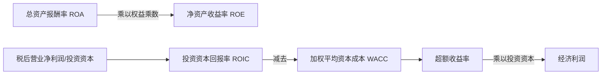
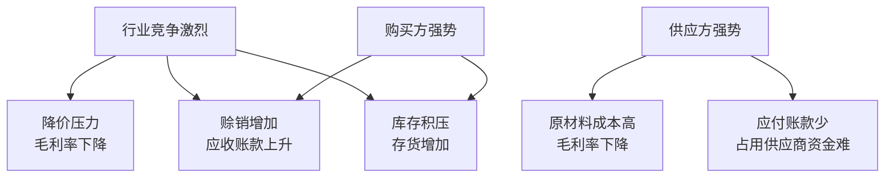
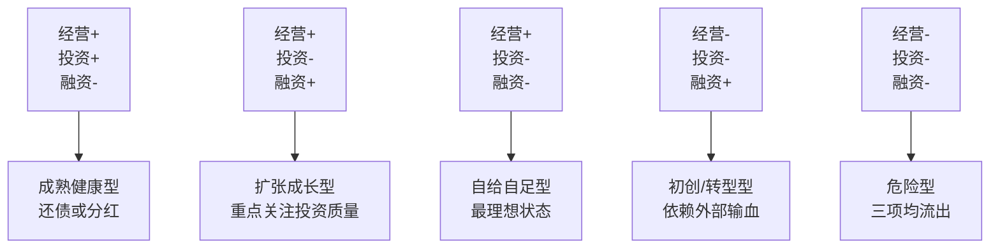

# 财务报表分析框架

财务数据是企业决策的结果，而非原因。分析财务报表的目的，是透过数字理解企业所处的行业环境、战略选择和执行能力。肖星在《一本书读懂财报》中提出，影响财务数据的因素有三：行业大环境、战略定位、战略执行。

## 同型分析

同型分析（结构百分比分析）是最基础的分析手法：将报表每个项目除以同一基准，显示结构比例而非绝对金额，便于跨企业、跨期间比较。

- **利润表同型分析：** 各项目除以营业收入，呈现从收入到利润的损耗结构
- **资产负债表同型分析：** 各项目除以总资产，呈现资产构成和资金来源结构

同型分析的价值在于配合比较：纵向比较自身历史趋势（趋势分析），横向比较竞争对手或行业均值（比较分析）。

## 比率分析

### 盈利能力

**毛利率 = (营业收入 - 营业成本) / 营业收入**

毛利率直接受战略定位（定价高低）和行业竞争程度影响，是分析的起点。

**净利润率 = 净利润 / 营业收入**

净利润率反映从收入到利润的整体损耗效率，受毛利率、三项费用管控、融资成本共同影响。

### 营运能力（效率指标）

各项资产周转率 = 营业收入（或营业成本）/ 该项资产平均余额

常用指标：应收账款周转率（应用营业收入）、存货周转率（应用营业成本）、固定资产周转率、总资产周转率。周转率越高，说明资产使用效率越高，完成"现金→资产→现金"循环的速度越快。

**注意：** 资产负债表数据是时点数，利润表数据是时段数，计算周转率时应用期初与期末资产的平均值作为分母。

总资产报酬率（ROA）= 净利润 / 总资产 = 净利润率 × 总资产周转率 = **效益 × 效率**

### 偿债能力

**短期偿债能力：**
- 流动比率 = 流动资产 / 流动负债（中国企业通常1-2之间，因短期借款常以借新还旧方式处理）
- 速动比率 = (流动资产 - 存货) / 流动负债（剔除变现最慢的存货）

**长期偿债能力：**
- 利息收入倍数（EBIT/利息）= (净利润 + 所得税 + 利息) / 利息，衡量偿还利息的能力
- 资产负债率（财务杠杆）= 总负债 / 总资产，中国上市公司平均约45%；航空等重资产行业可达80%

### 投资回报

**权益乘数 = 总资产 / 股东权益 = 1 / (1 - 资产负债率)**

ROE = ROA × 权益乘数。提高负债率（权益乘数）看似能提升ROE，但只有借来的钱能产生不低于ROA水平的回报时，ROE才能真正提升。

## 什么是真正的赚钱

净利润为正不等于真正赚钱。**经济利润 = (ROIC - WACC) × 投资资本**

- **ROIC（投资资本回报率）：** 税后营业净利润 / (有息负债 + 股东权益)，比ROA更精确（分子包含债权人回报，分母对应有息资本）
- **WACC（加权平均资本成本）：** 债务成本 × (1 - 税率) × 债务占比 + 权益成本 × 权益占比。利息有税盾效应，实际成本低于名义利率。权益成本通常用行业平均盈利水平衡量（机会成本）

经济利润大于0，才意味着这家企业为股东创造了超过行业平均水平的价值。经济利润长期为负的公司，股东把钱投在别处更划算。

## 行业因素对财务数据的影响

行业环境通过波特五力（行业内竞争、新进入者威胁、替代品威胁、购买方议价能力、供应方议价能力）影响企业财务数据。

造纸行业（资金密集）vs 家电行业（竞争激烈）对比：
- 造纸2002年毛利率28% vs 家电15%（反映竞争差异）
- 家电应收账款占总资产23% vs 造纸14%（反映购买方谈判能力）
- 造纸固定资产占62% vs 家电14%（反映行业资本密集度）

财务数据带有行业烙印，并随行业冷暖变化。

## 战略定位与财务表现

| 战略 | 财务特征 | 举例 |
|------|---------|------|
| 成本领先 | 低毛利 + 高周转率 | 沃尔玛、新闻纸生产 |
| 差异化 | 高毛利 + 低周转率 | 精品百货、卷烟纸生产 |

两种战略的ROA可以相当，只是路径不同。"低毛利但没有高周转"或"高毛利但没有低周转"，说明战略选对了但执行失效。

## 现金流风险矩阵

根据三类现金流的正负，企业可分为8种状态：

- **经营活动现金流** 最重要，持续为正是健康标志
- 投资活动现金流为正未必是好事，可能是在变卖资产
- 融资活动现金流为正未必是好事，要关注融资目的

**初创期企业**：经营-，投资-，融资+（依靠外部输血生存）。**成熟期企业**：经营+，投资-，融资-（自我造血+投资+分红）。**衰退期企业**：经营由正转负，若同时大量投资，资金链断裂风险极高。

## 利润 vs 现金流哪个更重要

两者矛盾的本质是收益与风险的权衡：

**应关注现金流的情况：**
- 资产价值存在大幅减值风险（应收账款/存货质量差）
- 行业面临替代品威胁或需求萎缩
- 企业处于高风险状态

**应关注利润的情况：**
- 资产质量可靠（如定制化生产，客户是大型运营商）
- 经营风险在可控范围内
- 生产周期长导致短期现金流天然为负，但订单有保障

一家电子书阅读器企业，净利润8000万、经营现金流-3.2亿，次年爆出5亿亏损——存货和应收账款积压说明资产质量已经恶化，此时现金流比利润更可信。一家通信设备企业，同样净利润高、经营现金流为负，但客户是电信运营商、采用定制化生产，资产质量有保障，利润更可信。

## 案例：如何给企业照镜子

以造纸行业A公司为例（2004年）：

1. **定位问题：** 总资产报酬率3% vs 竞争对手B公司7%，效益效率全面落后
2. **成本层面：** 规模是B的3倍却无规模经济效应，因为多产品线导致每条线单量不足
3. **费用层面：** 财务费用高（债务融资多）、营业费用高（产供销地域不匹配，运费占营业收入4%）、管理费用高（大量并购整合未完成）
4. **效率层面：** 在建工程占总资产28%（未产生收入但计入分母）、大量囤积原材料

**长期判断逆转：** 4年后A公司各项指标超过B公司。原因：多产品格局分散了结构性需求萎缩风险；原材料基地建成后降低了成本；B公司依赖草浆面临环保淘汰。财务分析不能只看当期数据，要结合行业趋势和战略布局。

## 投资决策原则：净现值 > 0

净现值（NPV）= 未来收益贴现总和 - 投资成本

NPV > 0 的经济含义：企业在有竞争优势的领域投资，才能获得高于行业平均水平的回报。竞争优势来自技术领先（成本低）、产能利用率高、销售能力强、品牌溢价、服务到位——而这些，都可以通过财务报表分析来评估和验证。
