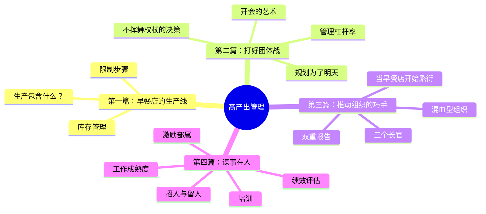
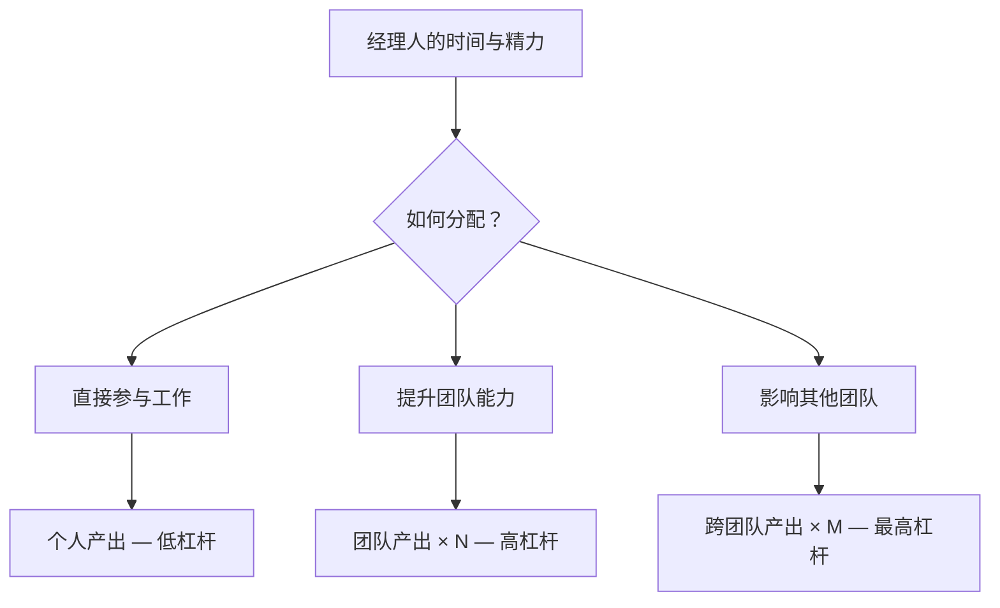
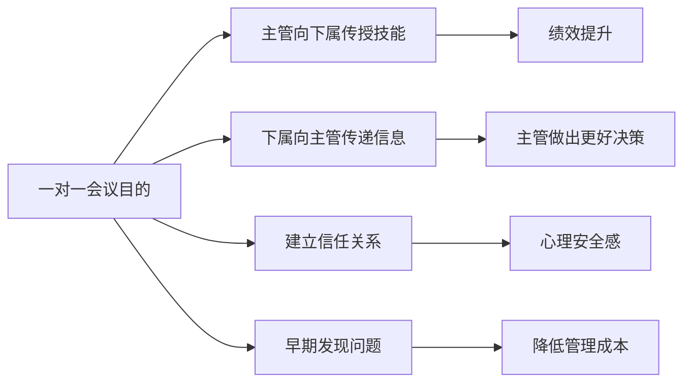
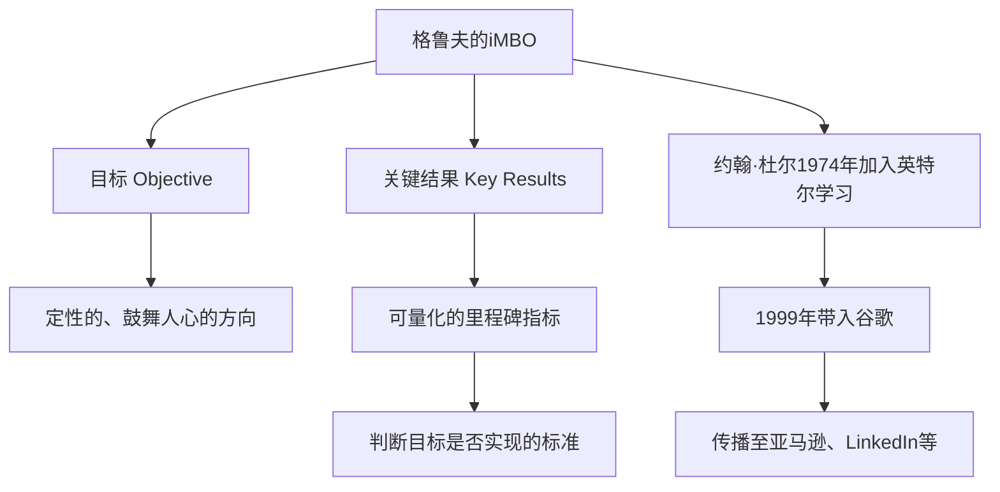
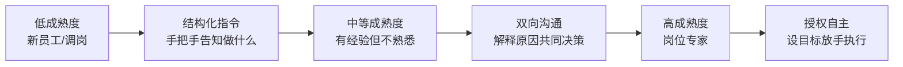
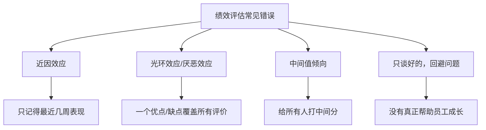
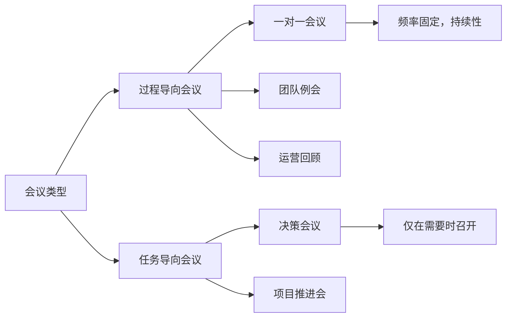

# 高产出管理

> "经理人的产出，等于其直接管辖团队的产出，加上其间接影响所及团队的产出。"
> ——安迪·格鲁夫，《格鲁夫给经理人的第一课》

《格鲁夫给经理人的第一课》（High Output Management，1983年初版，1995年修订）是英特尔CEO安迪·格鲁夫为**中层管理者** 撰写的实战管理手册。本书不同于传统商学院课程，它以工厂生产线作为隐喻，将管理工作量化为"产出"，系统阐述了如何最大化管理效能。

---

## 全书框架概览



---

## 核心框架一：管理者产出公式

格鲁夫提出了管理者产出的根本定义：

```
管理者产出 = 直属团队产出 + 影响所及团队产出
```

这意味着，**经理人自己的工作成果本身并不重要，重要的是通过团队放大的产出** 。



### 三种提升产出的方式

| 方式 | 描述 | 杠杆率 |
|------|------|--------|
| **提高工作速率** | 更快完成每项活动 | 低 |
| **增加高杠杆活动比例** | 减少低杠杆事务 | 中 |
| **提升团队整体能力** | 培训、招聘、激励 | 高 |

---

## 核心框架二：管理杠杆率（Leverage）

格鲁夫的"管理杠杆率"是本书最核心的概念之一。高杠杆活动是那些以少量管理者时间，产生大量产出影响的活动。

### 高杠杆活动

- **一对一会议（1:1 Meeting）** ：传授技能、了解进展、建立信任
- **绩效评估** ：对员工的工作方向和动力产生持久影响
- **招聘** ：一次正确的招聘胜过多次糟糕的管理干预
- **培训** ：一次培训可惠及十数人，而非一人
- **在关键决策节点上的参与** ：杠杆最高的干预时机

### 低杠杆（需减少的）活动

- 亲自完成可授权他人的任务
- 作为信息传递中介（而非决策者）参加会议
- 没有准备的会议
- 紧急救火式的管理

> "如果有一件事经理人可以做，让他们手下的员工工作更有效率，那就是培训。培训是一项高杠杆活动。"

格鲁夫强调的培训本质是"以教代学"——讲师在讲解知识的过程中自身理解也会加深。[[费曼学习法]] 从学习理论角度印证了这一点：内容留存率中"教授他人"高达90%，远超阅读和听讲。

---

## 核心框架三：一对一会议（1:1 Meeting）

格鲁夫将一对一会议视为**基本功课** ，是主管与直属下属之间最重要的沟通机制。



### 一对一会议的实践要点

| 要素 | 建议 |
|------|------|
| **频率** | 与低成熟度员工：每周；与高成熟度员工：可降低频率 |
| **时长** | 通常60-90分钟，不宜过短 |
| **议程主导**| 以** 下属**为主导，而非主管 |
| **记录** | 双方均需做笔记，便于追踪行动项 |
| **核心话题** | 工作进展、障碍、个人发展、信息共享 |

> "一对一会议的主要目的在于彼此传授技能及交流信息。通过对特定问题或状况的讨论，主管传授给部属所需的技能并教他们如何切入。"

---

## 核心框架四：OKR的起源：iMBO

格鲁夫在英特尔发展了一套**目标管理系统（iMBO: Intel Management by Objectives）** ，这正是后来传遍全球的[[OKR]]（Objectives and Key Results）的雏形。

### 格鲁夫的目标管理两个核心问题

> 1. 我想去哪里？（**目标，Objective** ）
> 2. 我怎么知道我正在朝那个方向前进？（**关键结果，Key Results** ）



### OKR vs 传统KPI

| 维度 | 传统KPI | 格鲁夫/OKR |
|------|---------|----------|
| 设定方式 | 自上而下 | 自下而上+对齐 |
| 完成标准 | 100%完成为优 | 70%完成为优，100%说明设得太保守 |
| 透明度 | 通常保密 | 全公司公开 |
| 与薪酬关系 | 强绑定 | 部分解耦 |
| 周期 | 年度为主 | 季度滚动 |

---

## 核心框架五：任务相关成熟度（Task-Relevant Maturity）

格鲁夫提出，管理风格应随员工的"任务相关成熟度"动态调整——这是一个针对**特定任务** 的成熟度概念，而非对员工整体能力的评判。



| 任务相关成熟度 | 合适的管理风格 | 重点 |
|--------------|-------------|------|
| **低** | 结构化指令式（Structured/Tell） | 具体告诉做什么、怎么做 |
| **中** | 沟通导向（Communicate） | 双向讨论、解释原因 |
| **高** | 授权监督（Monitor/Delegate） | 设定目标，放手执行 |

> "最佳的管理风格取决于具体情境，绝不是某个单一的方式。"

---

## 核心框架六：绩效评估的艺术

格鲁夫将绩效评估称为"再难也得做"的必要管理动作，并提出了具体的方法论。

### 绩效评估的两个目的

1. **提升绩效** （主要目的）：帮助员工改进
2. **薪酬决策** （次要目的）：与回报挂钩

### 绩效评估的常见错误



### 有效绩效评估的结构

| 阶段 | 内容 |
|------|------|
| **准备** | 列出过去周期的关键成就和不足 |
| **开场** | 明确本次评估是为了帮助提升，而非裁判 |
| **事实陈述** | 以具体行为和结果为据，而非性格判断 |
| **倾听** | 给员工充分表达的机会 |
| **行动计划** | 共同制定具体改进步骤 |
| **跟进** | 设定检查点 |

---

## 核心框架七：会议管理

格鲁夫将会议分为两类，并强调其不同目的：



**好会议的标准：**
- 主持人提前准备明确议程
- 每个议题有明确的决策/结论
- 每次会议结束有清晰的行动项和责任人
- 减少"信息汇报"类会议，用工具替代

---

## 核心框架八：三个"长官"与行为控制模式

格鲁夫将控制员工行为的力量归结为三种，并用 CUA 指标（Complexity 复杂性、Uncertainty 不确定性、Ambiguity 指令模糊性）选择最合适的控制模式：

| 控制模式 | 驱动力 | 适用场景 | 例子 |
|---------|-------|---------|------|
| 自由市场因素 | 个人利益最大化 | CUA 低、关注个人利益 | 采购谈判 |
| 契约义务 | 规则与监督 | CUA 低、关注群体利益 | 工作合同、红灯停车 |
| 文化价值观 | 大我胜于小我 | CUA 高、认同群体 | 车祸现场停车帮助 |

格鲁夫的洞见：一个刚入职的新员工关注自身利益，管理者应降低 CUA 给出明确框架；随着归属感增强，文化价值观逐渐接管。外聘高管风险最高——面对高 CUA 的烫手山芋，又尚未建立企业价值观。

---

## 对现代管理的影响

| 受影响的公司/框架 | 具体传承 |
|----------------|---------|
| **谷歌** | 约翰·杜尔1999年引入OKR，至今全公司使用 |
| **亚马逊** | 杰夫·贝索斯深受格鲁夫影响，发展出"逆向工作法" |
| **LinkedIn** | 杰夫·韦纳将OKR作为核心管理工具 |
| **Airbnb、Uber** | 硅谷新一代公司普遍采用OKR |

> "管理可以学习，但很难教导。"——德鲁克（格鲁夫在书中引用）

本书与[[金字塔原理]]共同构成了知识工作者结构化思维的两大基石：前者关于如何管理产出，后者关于如何结构化表达。

更多人物背景详见 → [[安迪·格鲁夫]]；全书精读详见 → [[格鲁夫给经理人的第一课]]
